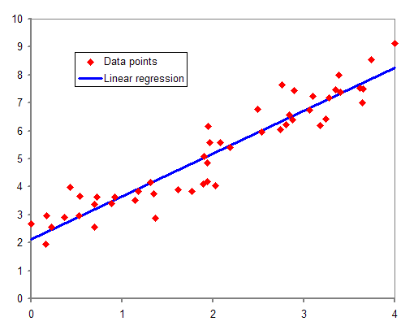
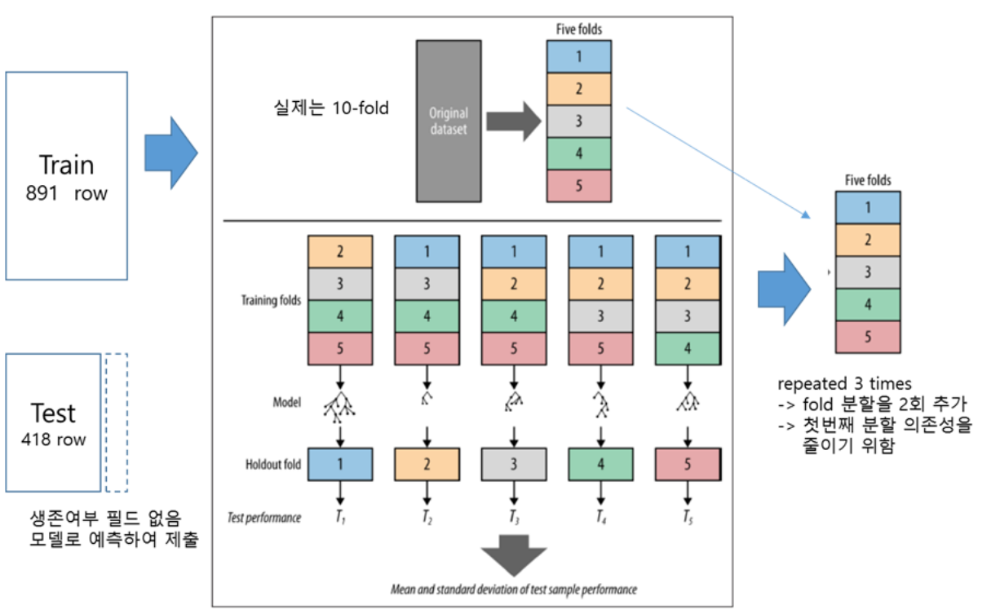
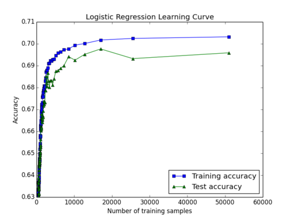
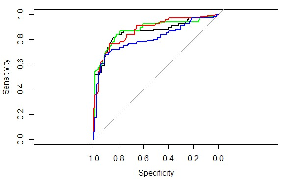
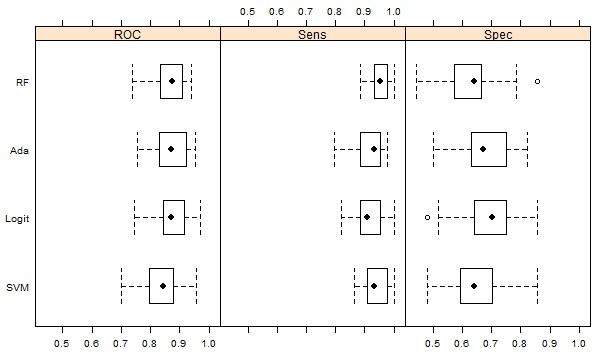

# 타이타닉 생존자 예측 문제 개요 
  * 이런 유형의 문제를 .. 분류와 계층 확률 추정이라고 함 
    * 각 개인이 어느 계층에 속할지를 예측하는 것
    * 일반적으로 계측은 상호 배타적임
    * ex) "메가텔 고객 중 마케팅 제안을 받아들일 가능성이 잇는 고객은? " 과 같은 질문에 대해 수용하는 계층과 거부하는 계층으로 나누는 경우


# 데이터 로딩에서 EDA 까지 

## 데이터 불러오기

```{r}
options(width=150)

# Titanic.path <- "/home/machi/r-test/11장_타이타닉예제/"
# Titanic.path <- "C:\\test\\r_test\\11장_타이타닉예제\\"
#Titanic.path <- "C:\\\\Users/user/Documents/eda/"
Titanic.path <- "https://raw.github.com/wehrley/Kaggle_Titanic/master/"

train.data.file <- "train.csv"
test.data.file <- "test.csv"  ## Survived 칼럼 값이 없음 
missing.types <- c("NA", "")

## 타입을 지정함 
train.column.types <- c('integer',   # PassengerId
                        'factor',    # Survived 
                        'factor',    # Pclass, 1,2,3등석
                        'character', # Name
                        'factor',    # Sex
                        'numeric',   # Age
                        'integer',   # SibSp, 함께 탑승한 형제 또는 배우자 
                        'integer',   # Parch, 함께 탑승한 부모 또는 자녀의 수 
                        'character', # Ticket, 티켓 번호
                        'numeric',   # Fare, 티켓 요금 
                        'character', # Cabin, 선실번호 
                        'factor'     # Embarked , 탑승한 곳 
)

##  # no Survived column in test.csv
test.column.types <- train.column.types[-2] 

readData <- function(path.name, file.name, column.types, missing.types) {
#   read.csv( url( paste(path.name, file.name, sep="") ), 
  read.csv( paste(path.name, file.name, sep=""), 
            colClasses=column.types,
            na.strings=missing.types , stringsAsFactors = F)
}

```


## 테스트 데이터 분리 

```{r}

train.raw <- readData(Titanic.path, train.data.file, 
                      train.column.types, missing.types)
df.train <- train.raw
str(df.train)


df.train$Survived <- factor(df.train$Survived, levels=c(0,1),labels=c("dead","Survived"))
# names(df.train)
levels(df.train$Embarked)
table(df.train$Embarked)

# table(df.train.train$Cabin)

test.raw <- readData(Titanic.path, test.data.file, test.column.types, missing.types)
df.infer <- test.raw 

```

## Data Munging

```{r}


# install.packages("Hmisc")
suppressPackageStartupMessages({
  library(Hmisc)
})


## method="reverse" 는 종속변수 survived 에 따라 독립 변수들을 분할하여 보여줌 

names(df.train)
summary(Survived ~ Pclass + Sex + Age + SibSp + Parch + Fare + Embarked, data = df.train, 
        method="reverse")


## 이를 그래프로 확인을
# install.packages("Amelia")
require(Amelia)
missmap(df.train, main="Titanic Training Data - Missings Map", 
        col=c("yellow", "black"), legend=FALSE)


## 실제 Embarked 필드에서 null 값이 있는 행에 대해서 확인을  
knitr::kable(df.train[!complete.cases(df.train$Embarked),])


barplot(table(df.train$Survived),
        names.arg = c("Perished", "Survived"),
        main="Survived (passenger fate)", col="black")
barplot(table(df.train$Pclass), 
        names.arg = c("first", "second", "third"),
        main="Pclass (passenger traveling class)", col="firebrick")
barplot(table(df.train$Sex), main="Sex (gender)", col="darkviolet")
hist(df.train$Age, main="Age", xlab = NULL, col="brown")
barplot(table(df.train$SibSp), main="SibSp (siblings + spouse aboard)", 
        col="darkblue")
barplot(table(df.train$Parch), main="Parch (parents + kids aboard)", 
        col="gray50")
hist(df.train$Fare, main="Fare (fee paid for ticket[s])", xlab = NULL, 
     col="darkgreen")
barplot(table(df.train$Embarked), 
        names.arg = c("Cherbourg", "Queenstown", "Southampton"),
        main="Embarked (port of embarkation)", col="sienna")


mosaicplot(df.train$Pclass ~ df.train$Survived, 
           main="Passenger Fate by Traveling Class", shade=FALSE, 
           color=TRUE, xlab="Pclass", ylab="Survived")


mosaicplot(df.train$Sex ~ df.train$Survived, 
             main="Passenger Fate by Gender", shade=FALSE, color=TRUE, 
             xlab="Sex", ylab="Survived")

boxplot(df.train$Age ~ df.train$Survived, 
        main="Passenger Fate by Age",
        xlab="Survived", ylab="Age")

mosaicplot(df.train$Embarked ~ df.train$Survived, 
           main="Passenger Fate by Port of Embarkation",
           shade=FALSE, color=TRUE, xlab="Embarked", ylab="Survived")

# install.packages("corrgram")
require(corrgram)
require(plyr)
corrgram.data <- df.train
## change features of factor type to numeric type for inclusion on correlogram
corrgram.data$Survived <- as.numeric(corrgram.data$Survived)
corrgram.data$Pclass <- as.numeric(corrgram.data$Pclass)
corrgram.data$Embarked <- revalue(corrgram.data$Embarked, c("C" = 1, "Q" = 2, "S" = 3))
## generate correlogram
corrgram.vars <- c("Survived", "Pclass", "Sex", "Age", "SibSp", "Parch", "Fare", "Embarked")
corrgram(corrgram.data[,corrgram.vars], order=FALSE, 
         lower.panel=panel.ellipse, upper.panel=panel.pie, 
         text.panel=panel.txt, main="Titanic Training Data")

# summary(df.train$Age)
# names(df.train)

```

## 간단한 모델 적용 

이 절에서는 기계학습 모델을 적용해 보고자 함 
여기서는 의사결정 나무 모델(rpart) 와 조건부 추론 나무(ctree) 를 사용함 

이유는 .. 쉽고 .. 다양한 변수의 상호 작용을 잘 표현해 주며,   
NA 값에 대한 대리 변수 처리가 잘 되기 때문임 

###  평가 메트릭 

탑승객 생존 여부 예측 모델의 성능은 정확도(accuracy) 로 하기로 함   
예측값과 실제값의 정확도는 아래와 같이 계산 (예시)

```{r}
predicted <- c(1,0,0,1,1)
actual <- c(1,0,0,0,0)
sum(predicted == actual) / NROW(predicted)
```


### 홀드아웃 기법 

  * 일반적으로 훈련, 테스트, 검증은 50:25:25 로 나눔
  * 여기서는 데이터가 많지 않기 때문에 훈련:테스트, 80:20 으로 나눔 
  * caret::createDataPartition() 함수를 사용함 

```{r}
# install.packages("caret")
suppressPackageStartupMessages({
  library(caret)
})
set.seed(23)
training.rows <- createDataPartition(df.train$Survived,  p = 0.8, list = FALSE)
train.batch <- df.train[training.rows, ]
test.batch <- df.train[-training.rows, ]
```


### 의사결정나무 

```{r}
suppressPackageStartupMessages({
  library(rpart)
})


m <- rpart(
  Survived ~ Pclass + Sex + Age + SibSp + Parch + Fare + Embarked, 
  data = train.batch
  )

## 훈련 데이터 기반 
p_rtree <- predict(m, newdata=test.batch, type="class")
rpart_result <- list(actual=test.batch$Survived, predicted=p_rtree)
head(rpart_result)


## 정확도 평가 
sum(rpart_result$predicted == rpart_result$actual) / NROW(rpart_result$actual)  # 10겹 교차는 뒤쪽에서 진행, 그때 정확도도 평균, 표준편차를 표시, 밀도그림도 .. 뒤쪽에서 보여줘야 겠고


# @@@ 제출용 코드
# names(all2)
# all2$Survived <- predict(m, newdata=all2, type="class")
# all2$Survived <- revalue(all2$Survived, c("Survived" = 1, "dead" = 0))
# head(all2)
# submission_01 <- all2[,c("PassengerId", "Survived")]
# setwd("C:\\Users\\user\\Documents\\eda\\submission")
# getwd()
# write.csv(submission_01, file = "test_decistion_tree_01.csv", row.names=FALSE)

```


### 조건부의사결정나무 

```{r}

suppressPackageStartupMessages({
  library(party)
})


model_ctree <- ctree(
  Survived ~ Pclass + Sex + Age + SibSp + Parch + Fare + Embarked, 
  data = train.batch
)
  
# predicted2  <- predict(model_rpart, newdata=df.train, type="class")
# cpart_result <- list(actual=df.train$Survived, predicted=predicted2)

## 훈련 데이터 기반 
p_ctree <- predict(model_ctree, newdata=test.batch, type="response")
ctree_result <- list(actual=test.batch$Survived, predicted=p_ctree)
head(ctree_result)

## 정확도 평가 
sum(ctree_result$predicted == ctree_result$actual) / NROW(ctree_result$actual)  # 10겹 교차는 뒤쪽에서 진행, 그때 정확도도 평균, 표준편차를 표시


```

> rpart 대비 성능이 향상되었음    

---

### 가설생성과 가설 검증을 통한 모델 피팅

1. 가설을 생성
    * 데이터 탐색을 통하여 데이터의특성들을 확인할 수 있었음
    * 이러한 데이터를 바탕으로 이 분야의 도메인 지식(knowledge)를 활용하여 새로운 가설을 생서함
    
2. 가설에 필요한 Feature를 추출
    * 1 에서 생성한 새로운 가설의 검증하기 위하여 필요한 Feature들을 가지고 있는 정보 내에서 추출함(extract)
 
3. 가설을 검증
    * 2 에서 생성된 Feature를 이용하여 1 에서 세운 가설이 맞는지 가설을 검증(hypothesis testing)함  

### 가설을 생성

1. 가설 1 "가족과의 관계가 생존에 영향을 주었을 것이다."
    * 타이타닉 영화를 보면 OOO이 살기위해 모르는 딸아이의 아빠인척을 하는 장면이 나온다.
    * 이처럼 가족의 생존확률이 높으면 자신의 생존 확률이 높을 것이라고 추정해 볼 수 있다.

1. 가설 2 "아이와 여자가 생존 확률이 높았을 것이다."
    * 타이타닉의 영화를 보면 보트에 아이와 여자를 먼저 태우는 장면을 볼 수 있다.
    * 이처럼 위급한 상황에서 아이와 여자들을 위하여 보트에 탑승을 양보했을 것이라고 추청할 수 있다.

1. 가설 3 "구명 보트에 가까이 있는 탑승자가 생존 확률이 높았을 것이다."
    * 보트는 제한된 수량만이 탐제가 되었다. 이는 타이타닉의 탑승객이 전부 탑승 할 수 없음을 의미하며,
    * 보트에 빠르게 탑승한 인원이 좀 더 생존확률이 높았을 것이라고 추정해 볼 수 있다.

여기서는 첫번째와 두번째 가설을 동시에 확인해 볼 예정이다.

### 가설에 필요한 Feature를 추출

  * 가족관계를 알기위해 ticket 을 사용한 가족 식별 
    * 한 가족이 표를 샀다면 티켓 번호가 같을 것이다. 
    * 티켓 가격정보도 가족수만큼 1/n 해서 정상화함 
  * 부모의 생존확률과 자녀의 평균 생존 확률을 파악
    * 앞에서 부모 자녀 여부를 판단하고 나면 부모의 평균 생존 확률(avg_parent_prob)과 자녀의 평균 생존 확률을 구함
  * Age의 null 값을 가족 관계를 통하여유추함 
    * 이름을 앞자리를 통하여 과족관계시의 나이를 유추
    * 자식의 나이는 부모보다 높을 수 없다. 또한 이름을 통하여 나이를 어느정도 유추가 가능하다.  
    
Title | 설명
--- | ---
Mr: (Mister) | (Mister) for men, regardless of marital status.
Master | for young men and boys, especially in the UK.
Ms | for women, regardless of marital status.
Mz | variation of Ms., used for women who do not wish to disclose their marital status.
Miss | usually for unmarried women
Mrs | for married women.
Mx | is a commonly accepted gender-neutral honorific.

* Embarked 필드는 제일 많은 S 값으로 채워줌  

주의할 점은 앞서 훈련, 테스트를 분리한 것을 합쳐서 사용함, 
전체 데이터를 가지고 처리 및 feature 분리를 할 것임

```{r}

suppressPackageStartupMessages({
  library(plyr)
})


  train.batch$type <- "T"
  test.batch$type <- "V"
  all <- rbind(train.batch, test.batch)  ## ticket 을 통해 가족ID를 부여하기 위해 훈련데이터와 테스트 데이터를 합침 
  
  ## mbarked 필드는 제일 많은 S 값으로 채워줌 
  summary(all$Embarked)
  all$Embarked[which(is.na(all$Embarked))] <- 'S'


### 당초 타이틀을 통해 나이 등을 유추하는 것 추가
### 기존 대비 차이점은 all  상태에서 처리를 

head(df.train$Name, n=10L)
getTitle <- function(data) {
  title.dot.start <- regexpr("\\,[A-Z ]{1,20}\\.", data$Name, TRUE)
  title.comma.end <- title.dot.start + attr(title.dot.start, "match.length")-1  ## copy&paste 시 중간 공백주의 필요 
  data$Title <- substr(data$Name, title.dot.start+2, title.comma.end-1)
  return(data$Title)
} 


 all$Title <- getTitle(all)
 unique(all$Title)

options(digits=2)
require(Hmisc)
bystats(all$Age, all$Title, 
        fun=function(x)c(Mean=mean(x),Median=median(x)))


titles.na.train <- c("Dr", "Master", "Mrs", "Miss", "Mr")


imputeMedian <- function(impute.var, filter.var, var.levels) {
  for(v in var.levels) {
    impute.var[which(filter.var == v)] <- impute(impute.var[which(filter.var == v)])
  }
  return(impute.var)
}

all$Age[which(all$Title=="Dr")]

all$Age <- imputeMedian(all$Age, all$Title, titles.na.train)
all$Age[which(all$Title=="Dr")]


subset(all, Fare < 7)[order(subset(all, Fare < 7)$Fare, 
                          subset(all, Fare < 7)$Pclass), c("Age", "Title", "Pclass", "Fare")]


## impute missings on Fare feature with median fare by Pclass
all$Fare[ which(all$Fare == 0)] <- NA
all$Fare <- imputeMedian(all$Fare, all$Pclass, as.numeric(levels(all$Pclass)))

all$Title <- factor(all$Title,c("Capt","Col","Major","Sir","Lady","Rev","Dr","Don","Jonkheer","the Countess","Mrs","Ms","Mr","Mme","Mlle","Miss","Master","Noble"))   ##Noble 를 추가해줌 
# head(all[,c("Age", "Title")], n=100)
boxplot(all$Age ~ all$Title, 
        main="Passenger Age by Title", xlab="Title", ylab="Age")

## function for assigning a new title value to old title(s) 
changeTitles <- function(data, old.titles, new.title) {
  for(honorific in old.titles) {
    data$Title[which(data$Title == honorific)] <- new.title
  }
  return(data$Title)
}

str(all)
levels(all$Title)

## Title consolidation
all$Title <- changeTitles(all, c("Capt", "Col", "Don", "Dr", "Jonkheer", "Lady", "Major", "Rev", "Sir"),"Noble")
all$Title <- changeTitles(all, c("the Countess", "Ms"), "Mrs")
all$Title <- changeTitles(all, c("Mlle", "Mme"), "Miss")
all$Title <- as.factor(all$Title)

require(plyr)     # for the revalue function 
require(stringr)  # for the str_sub function

## test a character as an EVEN single digit
isEven <- function(x) x %in% c("0","2","4","6","8") 
## test a character as an ODD single digit
isOdd <- function(x) x %in% c("1","3","5","7","9") 

## function to add features to training or test data frames
featureEngrg <- function(data) {
  ## Using Fate ILO Survived because term is shorter and just sounds good
  data$Fate <- data$Survived
  ## Revaluing Fate factor to ease assessment of confusion matrices later
  data$Fate <- revalue(data$Fate, c("1" = "Survived", "0" = "Perished"))
  ## Boat.dibs attempts to capture the "women and children first"
  ## policy in one feature.  Assuming all females plus males under 15
  ## got "dibs' on access to a lifeboat
  data$Boat.dibs <- "No"
  data$Boat.dibs[which(data$Sex == "female" | data$Age < 15)] <- "Yes"
  data$Boat.dibs <- as.factor(data$Boat.dibs)
  ## Family consolidates siblings and spouses (SibSp) plus
  ## parents and children (Parch) into one feature
  data$Family <- data$SibSp + data$Parch
  ## Fare.pp attempts to adjust group purchases by size of family
  data$Fare.pp <- data$Fare/(data$Family + 1)
  ## Giving the traveling class feature a new look
  data$Class <- data$Pclass
  data$Class <- revalue(data$Class, 
                        c("1"="First", "2"="Second", "3"="Third"))
  ## First character in Cabin number represents the Deck 
  data$Deck <- substring(data$Cabin, 1, 1)
  data$Deck[ which( is.na(data$Deck ))] <- "UNK"
  data$Deck <- as.factor(data$Deck)
  ## Odd-numbered cabins were reportedly on the port side of the ship
  ## Even-numbered cabins assigned Side="starboard"
  data$cabin.last.digit <- str_sub(data$Cabin, -1)
  data$Side <- "UNK"
  data$Side[which(isEven(data$cabin.last.digit))] <- "port"
  data$Side[which(isOdd(data$cabin.last.digit))] <- "starboard"
  data$Side <- as.factor(data$Side)
  data$cabin.last.digit <- NULL
  return(data)
}

## add remaining features to training data frame
all <- featureEngrg(all)

  summary(all$Fare)  ## 이 정보와 앞서 EDA쪽을 연결시킴 

  ctree_model <- ctree(Survived ~ Pclass + Sex + Age + SibSp + Parch + Fare + Embarked,data = all)

#   all <- df.train
  
  all$prob <- sapply(predict(ctree_model,type="prob", newdata=all), function(result){ result[1]})
  head(all)
  
  ## 티켓 번호를 사용한 family_id
  family_idx <- 0
  ## 같은Ticket 값을 갖는 행끼리 그룹핑 , 번호를 부여해줌 
  ticket_based_family_id <- ddply(all, .(Ticket), function(rows) {    
    family_idx <<- family_idx +1
    return(data.frame(family_id=paste0("TICKET_", family_idx)))
  })
  

  all <- adply(all
    , 1
    , function(row) {
        family_id <- NA
        if(!is.na(row$Ticket)) {
          family_id <- subset(ticket_based_family_id, Ticket == row$Ticket)$family_id
        }
        return(data.frame(family_id=family_id))
      })

  ### avg_prob 를 구함
  all <- ddply(all,
      .(family_id)
      , function(rows){
          rows$avg_prob <- mean(rows$prob)
          return(rows)
      })


  ### 탑승객이 부모 또는 자녀 중 어느 쪽에 속하는지를 알아봄
  ### 판단 기준은 나이를 사용

  all <- ddply(all, .(family_id), function(rows){
            rows$maybe_parent <- FALSE
            rows$maybe_child <- FALSE
            if(NROW(rows) == 1 || ## 1명이면 부모도 자녀도 아님
              sum(rows$Parch) == 0 || ## 역시 부모도 자녀도 아님
              NROW(rows) == sum(is.na(rows$Age))){ ## 행에 나이가 저장되어 있지 않으면 알 수 없음
              return (rows)
            }

            max_age <- max(rows$Age, na.rm=TRUE)
            min_age <- min(rows$Age, na.rm=TRUE)

            ## 부모인지 , 자녀인지 
            return(adply(rows, 1, function(row){
              if(!is.na(row$Age) && !is.na(row$Sex)) {
                row$maybe_parent <- (max_age - row$Age) < 10 ## > 로 되어야 하는 것 아닌가?
                row$maybe_child <- (row$Age - min_age) < 10
              }
              return(row)
          }))

        })

  ## avg_parent_prob , avg_child_prob
  all <- ddply(all, .(family_id), function(rows) {
              rows$avg_parent_prob <- rows$avg_prob ## 기본값은 가족의 평균 생존 확률
              rows$avg_child_prob <- rows$avg_prob ## 기본값은 가족의 평균 생존 확률
              if(NROW(rows) == 1 || sum(rows$Parch) == 0 ) {
                return(rows)
               }
              parent_prob <- subset(rows, maybe_parent == TRUE)[,"prob"]
              if(NROW(parent_prob) > 0 ) {
                  rows$avg_parent_prob <- mean(parent_prob)
              }
              child_prob <- subset(rows, maybe_child == TRUE)[,"prob"]
              if(NROW(child_prob) > 0 ) {
                rows$avg_child_prob <- mean(child_prob)
              }

              return(rows)
          })


  ## 다시, 훈련 데이터와 테스트 데이터를 구분함 
  train.batch <- subset(all, type == "T")
  # str(f$train)
  test.batch <- subset(all, type == "V")

  ## ctree 모델
  # 새로 구성한 변수들을 독립 변수로 추가하여 ctree() 모델 생성
  ## 당연히 모델은 훈련데이터로 만들고 
  m <- ctree(Fate ~ Pclass + Sex + Age + SibSp + Parch + Fare + Embarked + Title
        + maybe_parent + maybe_child + avg_prob + avg_parent_prob + avg_child_prob,data=train.batch)
  print(">>>> 새로운 특징을 적용한 ctree 모델 생성 결과")
  print(m)
  print(">>>> 새로 추가된 특징(avg_prob, Title)들이 ctree의 상위 노드에 사용되는지 확인해보자)")
  # 생성된 ctree 모델에 검증 데이터 적용
  test.batch$new_predicted <- predict(m, newdata=test.batch)
#   head(test.batch)
  # 검증 데이터에 대해 생존 여부 예측 결과(predicted) 및 실제 결과(actual)를 합쳐 list로 반환


##성능평가 결과는 다음과 같음
(family_accuracy <- sum(test.batch$new_predicted == test.batch$Fate) / NROW(test.batch$Fate) )


```

추가 feature 로 정확도가 상승했는지 확인을 하고,,, (ctree 모델을 통해)


```{r}

# train.keeps <- c("Fate", "Sex", "Boat.dibs", "Age", "Title", 
#                 "Class", "Deck", "Side", "Fare", "Fare.pp", 
#                   "Embarked", "Family","Survived")  ## Survived 을 추가함 
# df.train.munged <- df.train[train.keeps]

names(train.batch)
train.keeps <- c("Fate", "Sex", "Boat.dibs", "Age", "Title", "SibSp","Parch",
                "Class", "Deck", "Side", "Fare", "Fare.pp", 
                  "Embarked", "Family","Survived","avg_prob","family_id"
                ,"maybe_parent", "maybe_child", "avg_parent_prob", "avg_child_prob" )  ## Survived 을 추가함 
train_batch_munged <- train.batch[train.keeps]
names(train_batch_munged)
head(train_batch_munged)

```

# Fitting a Model

## 로지스틱 회귀분석을 통한 변수 최적화

> 추정(estimation)과 추정의 결과를 검증(evaluation)하여 적합한 모델을 만들어 낸다.

#### 로지스틱 회귀분석을 통한 변수 최적화
   * [선형회귀](https://ko.wikipedia.org/wiki/%EC%84%A0%ED%98%95_%ED%9A%8C%EA%B7%80)
    * 
    * [종속 변수](http://terms.naver.com/entry.nhn?docId=76283&cid=42155&categoryId=42155) y와 한 개 이상의 [독립 변수](http://terms.naver.com/entry.nhn?docId=76283&cid=42155&categoryId=42155) (또는 설명 변수) X와의 선형 상관 관계를 모델링하는 회귀분석 기법
    * 회귀식: y'=a+bx   y'=종속 변수(예측 대상) x=독립 변수(y'에 영향을 미치는 변수) a,b는 회계 계수
    * 한 개의 설명 변수에 기반한 경우에는 단순 선형 회귀, 둘 이상의 설명 변수에 기반한 경우에는 다중 선형 회귀라고 한다.
   * [로지스틱회귀](https://ko.wikipedia.org/wiki/%EB%A1%9C%EC%A7%80%EC%8A%A4%ED%8B%B1_%ED%9A%8C%EA%B7%80)
    * 
    * 선형 회귀 분석을 기반으로 종속 변수가 범주형 데이터를 대상으로 함   
 * 장점
      * 모든 표본점이 고려된다.
      * 정확하고 분석자의 주관적 판단이 개입될 여지가 없으므로 객관적이다.
      * 변수의 움직임의 관계의 정도, 통계적 유의성, 잔차나 분산의 크기를 결정할 수 있다.
 * 단점
      * 계산 과정이 복잡하다.
      * 회귀 분석의 여러 가정이 충족되어야 한다.
      * UnderFitting 경향이 높음, 정학도가 낮게나올 가능성
 * 다중공선성(multicollinearity)을 주의
      * 각 독립변수들간의 강한 상관관계가 있을 수 있음
      * 독립 변수들 사이의 상호의존도가 높으면 회귀계수의 부호가 바뀌거나 0에 가까운 값으로 나타남
      * 상관 관계가 높은 변수들 중 하나만 남기고 나머지 변수들을 모형에서 제거 
   
---
    
참고 설명   
최대 사후 확률(最大事後確率, maximum a posteriori, MAP)은 베이즈 통계학에서 사후 확률(事後確率)의 최빈값을 가리킨다. 최대 사후 확률에 대응하는 모수(母數, Parameter)는 최대우도(最大尤度, maximum likelihood estimation, MLE)와 마찬가지로 모수의 점 추정으로 사용할 수 있지만, 최대우도에서는 어떤 사건이 일어날 확률을 가장 높이는 모수를 찾는 것에 비해, 최대 사후 확률 모수는 모수의 사전 확률(事前確率)과 결합된 확률을 고려한다는 점이 다르다.
    
    
```{r}
(Titanic.logit.1 <- glm(Fate ~ Class + Sex + Age + SibSp + Parch + Title + Fare 
                        + Embarked + maybe_parent + maybe_child + avg_prob 
                        + avg_parent_prob + avg_child_prob,data=train_batch_munged, family=binomial("logit")))

# 이에 대한 p-value 는 아래와 같이 구함 
### The deviance was reduced by 332.2(765.4-464.5) points on 568-554=8 degrees of freedom (DF), a significant reduction..
1 - pchisq((765.4-464.5), df=(568-554))  ## 0 유의미한 차이가 있고, 모델이 잘 수행한다고 봐야 ??  
                       
```

  * glm으로 logit regression을 만들고, model fit을 확인하려면?
  * model이 데이터를 설명하는 예측력을 따져봄. -> Pearson chi-square를 계산
    * `1 - pchisq(deviance(model), df.residual(model))`
  * p-value를 통하여 유의미하지 않다는 것을 확인하여 영향이 없다는 귀무가설을 기각 할 수 있다.
  * [카이제곱검정](https://ko.wikipedia.org/wiki/%EC%B9%B4%EC%9D%B4%EC%A0%9C%EA%B3%B1_%EA%B2%80%EC%A0%9)
    
---

추가로 다른 feature 조합 들간의 비교를 위해 `anova()` ([분산분석](https://ko.wikipedia.org/wiki/%EB%B6%84%EC%82%B0%EB%B6%84%EC%84%9D)를 사용    
  * 평균과 분산을 기초로 여러 집단을 비교하고, 이들 집단의 평균값에 차이가 있는지 가설검정을 하는 통계분석 기법(여러 집단의 continuous variable을 비교) 

```{r}
# anova(Titanic.logit.1)
anova(Titanic.logit.1, test="Chisq")
```

여기서 Sex, Pclass, Age, Title, SibSp, avg_prob 변수의 중요도를 확인할 수 있음 

   * [자유도(degree of freedom)](https://ko.wikipedia.org/wiki/%EC%9E%90%EC%9C%A0%EB%8F%84_(%ED%86%B5%EA%B3%84%ED%95%99))
    * 독립적인 자료의 수
   * [p-value](https://ko.wikipedia.org/wiki/P-value)
    * 유의확률을 확인하기 위한 계산값  
    * p-value < 0.05 이며 유의수준 5% 에서 통계적으로 효과가 있다고 봐야합
      (영향이 없다는 귀무가설(null hypothesis)을 기각하고, 영향이 있다(즉 독립이 아니다)는 대립가설(alternative hypothesis) 채택)
   * [잔차(residual)](https://ko.wikipedia.org/wiki/%EC%9E%94%EC%B0%A8)
    * 모형에 의하여 추정된 종속변수의 값과 실제 관찰된 종속변수 값과의 차이 -> 모형에서의 오차
   * [AIC 통계량](https://en.wikipedia.org/wiki/Akaike_information_criterion)
    * 최적 모형을 결정하는 경우 모형의 설명능력과 모형의 절약성을 고려, 두 판단기준을 함께 고려한 선택규준.
    * AIC = -2 log L(log-[likelihood](http://dermabae.tistory.com/188)) +2n

Deviance (편차), Resid. Df (Residual degrees of freedom, 잔차 자유도), Resid. Dev(Residual Deviance, 잔차 편차)


---
`AIC(fit)`   
[1] 263.8177   
`BIC(fit)`   
[1] 271.6332   
`logLik(fit)`   
'log Lik.' -128.9088 (df=3)   

```{r}
Titanic.logit.2 <- glm(Fate ~ Class + Sex + Age + Title + avg_prob 
                       , data = train_batch_munged, family=binomial("logit"))
anova(Titanic.logit.2, test="Chisq")
```
    

   * 교차 검증 후 테스트 
    * 데이터를 훈련 데이터와 테스트 데이터로 분리함 
    * 훈련 데이터에 대해 K겹 교차 검증(보통 10겹) 을 수행하여 어떤 모델링 기법이 가장 우수한지를 결정함 
        1. 데이터를 10 등분하여 $D_{1}$, $D_{2}$,,,,, $D_{10}$으로 분할함 
        2. K 값을 1로 초기화 함
        3. $D_{K}$ 를 검증 데이터, 그 외의 데이터를 훈련 데이터로 하여 모델을 생성함 
        4. 검증 데이터 $D_{K}$ 를 사용해 모델의 성능을 평가함, 평가된 모델의 성능을 $P_{K}$ 라 함 
        5.  K 가 9이하인 값이면 K = K + 1 을 하고 다시 3단계로 감, 만약 K=10 이면 종료함 
          * 모델의 성능이 $P_{1}$,$P_{2}$,,,, $P_{10}$ 으로 구해지며, 최종 성능은 이들의 산술 평균으로 정함 
    * 해당 모델링 기법으로 훈련 데이터 전체를 사용해 최종 모델을 만듬
    * 테스트 데이터에 최종 모델을 적용해 성능을 평가하고, 그 결과를 최종 모델과 함께 제출함
    
    * Trainnig Data의 갯수
      * 많은면 많을 수록 좋다. 하지만 보다 중요한 것은 제대로 된 데이터를 가지고 있는 것
        * 
    * [과적합(Overfiting)](https://en.wikipedia.org/wiki/Overfitting)
      * 많은 데이터를 Train 하게되면 unseen 데이터에 대해 낮은 예측력이 생길 수 있다.  
        * 

---

`trainControl()` 함수를 통하여 Cross-Validation 설정   

```{r}
cv.ctrl <- trainControl(method = "repeatedcv", repeats = 3,
                        summaryFunction = twoClassSummary,
                        classProbs = TRUE)
```

`glm()` 함수를 이용하여 로지스틱 회귀를 진행, 최적화를 하기 위한  Metric으로 ROC curve (AUC) 를 사용. `summary()` 함수로 회귀계수(regression coefficients), 표준오차(standard error), z-test, 잔차 편차(residual deviance)를 확인한다. 


```{r}
# install.packages("pROC")

suppressPackageStartupMessages({
  library(pROC)
})
set.seed(35)
glm.tune.1 <- train(Fate ~ Class + Sex + Age + Title + avg_prob
                    ,data = train_batch_munged
                    ,method = "glm"
                    ,metric = "ROC"  ## ROC 구체적으로는 AUC 가 최대가 되도록 최적화 하겠다는 의미임 
                    ,trControl = cv.ctrl)
glm.tune.1
summary(glm.tune.1)
```

예측률 | 증감 | 순위 | 모델
--- | --- | --- | ---
0.73684 | - | 3162  | glm.tune.1

> 기존 코드보다는 결과가 좋아짐 


70%의 탑승객이 Southampton에서 탑승함. Embarked를 I() 함수를 이용하여 2차원으로 축소하여 처리   

```{r}
set.seed(35)
glm.tune.2 <- train(Fate ~ Class + Sex + Age + Title + avg_prob + I(Embarked=="S")
                      ,data = train_batch_munged
                      , method = "glm"
                      ,metric = "ROC"
                      , trControl = cv.ctrl)
summary(glm.tune.2)
```

As I discussed earlier, the 'Title' feature addresses more than one theme. For that reason, I believe it has real potential to improve this model. Besides, I put a good chunk of effort into it, so why not give it a go?

Title에서 중요한 영향을 줄 수 있는 잠재력이 있어 보임

```{r}
set.seed(35)
glm.tune.3 <- train(Fate ~ Class + Sex + Age + Title + avg_prob + I(Embarked=="S")
                    , data = train_batch_munged
                    , method = "glm"
                    ,metric = "ROC"
                    , trControl = cv.ctrl)
summary(glm.tune.3)
```

Nice! That gave us our first material decline in the residual deviance. Since the Title feature seems to give us everything that Age did (and more), I'm going to drop Age from the formula. I will also collapse the titles “Miss” and “Mrs” and leave a duo of Title-related factors which should represent the “women and children first” theme well.

앞서 우리는 '영자와 아이 우선' 가설을 생성함, Title로 가설에 중요한 변수를 처리함 

```{r}
 set.seed(35)
 glm.tune.4 <- train(Fate ~ Class + Sex + avg_prob 
                     + I(Title=="Mr") + I(Title=="Noble") + Age + Family 
                     + I(Embarked=="S")
                     ,data = train_batch_munged
                     ,method = "glm"
                     ,metric = "ROC"
                     , trControl = cv.ctrl)
summary(glm.tune.4)
```


Remember that there were a lot of male passengers in third class. Given the “women and children first” policy already mentioned plus reports that the Titanic's internal layout was confusing (I recall reading that one crew member claimed it took him two weeks to become comfortable with finding his way around the ship), to say that “grown men in the lower decks had it tough” is such a gross understatement that I hesitated to put it in type. A feature reflecting those third-class men might make a further dent in that residual deviance. Indeed, it does...

'여자와 아이들 우선'의 가설을 검증하기 위하여 I()함수를 이용하여 몇 가지 피쳐를 추가

변수의 특정 조건 연산을 통해 feature를 추가 ..   

```{r}
 set.seed(35)
 glm.tune.5 <- train(Fate ~ Class + Sex + avg_prob  
                     + I(Title=="Mr") + I(Title=="Noble") + Age + Family 
                     + I(Embarked=="S") + I(Title=="Mr"&Class=="Third")
                     , data = train_batch_munged
                     , method = "glm"
                     , metric = "ROC"
#                      , metric = "Accuracy"
                     , trControl = cv.ctrl)
summary(glm.tune.5)

test.batch$new_predicted <- ''
test.batch$new_predicted <- predict(glm.tune.5, newdata=test.batch)
(glm.tune.5_accuracy <- sum(test.batch$new_predicted == test.batch$Fate) / NROW(test.batch$Fate) )


#' @@@ 제출용 코드
# all2 <- test.raw
# names(all2)
# head(all2)
# str(all2)
# dim(all2)

# ## 실제 Embarked 필드에서 null 값이 있는 행에 대해서 확인을  
# all2[!complete.cases(all2$Age),]
# all2[!complete.cases(all2$Title),]
# predict(glm.tune.5, newdata=all2, type="raw")
# 
# require(Amelia)
# missmap(all2, main="Titanic Training Data - Missings Map", 
#         col=c("yellow", "black"), legend=FALSE)


# all2$PassengerId
# all2$Survived <- ''
# all2$Survived <- predict(glm.tune.1, newdata=all2, type="raw")
# all2$Survived <- revalue(all2$Survived, c("Survived" = 1, "dead" = 0))
# head(all2)
# submission_01 <- all2[,c("PassengerId", "Survived")]
# setwd("C:\\Users\\jihwan\\Documents\\eda\\eda\\submission")
# getwd()
# write.csv(submission_01, file = "test_glm_tune_01.csv", row.names=FALSE)


```

가장 낮은 AIC 도출 .. 

# Other Models 

지금까지 새로운 feature 를 생성해 보고, 변수의 특정 조건 연산을 통해 feature를 추가해 보기도 하였음 ( `I(Title=="Mr"&Class=="Third")`)

이번에는 알고리즘 변경 및 최적화를 통해 예측 성능을 개선하는 접근을 시도함 
이또한 다음과 같은 접근을 필요로 함 


  * 데이터에 대해 훈련해야 할 기계 학습 모델이 무엇인가? 
  * 어떤 모델 매개변수를 조절하고 최적의 설정을 찾기 이해 어떻게 조절할 것인가?  
    * 
  * 최적의 후보자를 구별하기 위해 모델을 평가하는 기준은 무엇인가? 
  * 최신 기법, 패키지를 사용해 볼 것인가? 


여기서는 boosting -> 앙상블 -> 보다 발전적인 Random Forest 순으로 살펴봄   

Logistic regression is certainly not the only binary classification model available. There are plenty more ???- perhaps too many for some data scientists to digest. For purpose of illustration, I'll simply take the logistic regression model formula from glm.tune.1 and pass it through train() for each of three other model types, with one new twist: tuning variables specific to each model.


## SVM (support vector machine)

  * 서포트 벡터머신은 서로 다른 분류에 속한 데이터 간에 간격이 최대가 되는 선(또는 평면)을 찾아 이를 기준으로 데이터를 분류하는 모델임  
      
    * 서포트 벡터 머신은 각 분류에 속하는 데이터로부터 같은 간격으로, 그리고 최대로 멀리 떨어진 선 또는 평면을 찾음 
    * 이러한 선 또는 평면을 최대 여백 초평면(Maximum Margin Hyperplane) 이라고 하고, 이 평면이 분류를 나누는 기준이 됨 
    * 하지만, 모든 데이터를 항상 초평면으로 나눌 수 있는 것은 아님
      * 아래 왼쪽의 경우, 곡선 기준을 통해 평면을 찾을 수 없기 때문에 주어진 데이터를 적절한 고차원으로 옮긴 뒤 변환된 차원에서 서포트 벡터 머신을 사용해 초평면을 찾는 방식을 사용하는데 이를 커널 트릭이라고 함 
       
      * 커널 트릭에서는 실제로 데이터를 고차원으로 변환하는 대신 고차원에서 벡터 간 내적 계산을 했을 때와 같은 값을 반환하는 함수들을 사용한다. 
        * 이 함수들을 사용하면 마치 데이터를 고차원으로 옮긴 듯한 효과를 일으키면서도 데이터를 고차원으로 옮기는데 따른 계산 비용 증가는 피할 수 있고 .. 이러한 함수들을 커널함수라고 부른다. 
        * 대표적인 커널 함수로 다항 커널(Polynomial Kernel), 가우시안 커널(Gaussian Kernel),  레이디얼 베이스 함수(Radial Basis Function Kernel) 이 있음
        * 또한 이들 커널 함수는 커널 파라미터를 갖고, 이 파라미터를 조정함으로써 최적화를 할 수 있다.  
        * 여기서는 Radial Basis Function Kernel 함수를 사용하고,  tuneLength = 9를 통해 Cost 파라미터 C (제약을 위반하는 비용을 명시하는 수임 ) 값의 범위 c(0.25, 0.5, 1, 2, 4, 8, 16, 32, 64) 에서의 성능을 표시함으로써 적절한 파라미터값을 찾는 과정을 보여 줄 것이다. 
    * SVM 의 장점은   
      * 범주나 수치 예측 문제에 대해 사용할 수 있음 
      * 노이즈 데이터에 영향을 크게 받지 않고 잘 과적합화되지 않음 
      * 신경망보다 사용하기 쉽다. 
      * 높은 정확도로 인기가 높음 
    * SVM의 단점은 
      * 최적의 모델을 찾기 위해 커널과 모델에서 매개변수의 여러 가지 조합 테스트가 필요함 
      * 특히 입력 데이터셋이 예제 개수와 속성의 수가 많다면 훈련이 느릴 수 있음 
      * 해석하기 불가능하지는 않지만, 어렵고 복잡한 블랙박스를 만든다. 
  * 서포트 벡터머신에 대해 보다 자세한 설명은 아래 링크를 참고 
    * https://ko.wikipedia.org/wiki/%EC%84%9C%ED%8F%AC%ED%8A%B8_%EB%B2%A1%ED%84%B0_%EB%A8%B8%EC%8B%A0음


```{r}
# install.packages("kernlab")
suppressPackageStartupMessages({
  library(kernlab)
})

set.seed(35)
svm.tune <- train(Fate ~ Class + Sex + avg_prob  
                     + I(Title=="Mr") + I(Title=="Noble") + Age + Family 
                     + I(Embarked=="S") + I(Title=="Mr"&Class=="Third"),
                  data = train_batch_munged,
                  method = "svmRadial",
                  tuneLength = 9,
                  preProcess = c("center", "scale"),
                  metric = "ROC",
                  trControl = cv.ctrl)

svm.tune
plot(svm.tune)


## 정확도 
test.batch$new_predicted <- ''
test.batch$new_predicted <- predict(svm.tune, newdata=test.batch)
(svm.tune_accuracy <- sum(test.batch$new_predicted == test.batch$Fate) / NROW(test.batch$Fate) )

# # @@@ 제출 
# # all2$PassengerId
# all2$Survived <- ''
# all2$Survived <- predict(svm.tune, newdata=all2, type="raw")
# all2$Survived <- revalue(all2$Survived, c("Survived" = 1, "dead" = 0))
# head(all2)
# submission_01 <- all2[,c("PassengerId", "Survived")]
# setwd("C:\\Users\\user\\Documents\\eda\\submission")
# getwd()
# write.csv(submission_01, file = "test_svm_tune_01.csv", row.names=FALSE)


```

cost 파라미터에 대한 ROC 값을 보여준다. 여기서는 c=2 에서 ROC 값이 가장 크게나옴 


## 랜덤포레스트

  * 앙상블 학습 기법을 사용한 모델임 
    * 앙상블 학습 : 주어진 데이터로부터 여러개의 모델을 학습한 다음, 예측 시 여러 모델의 예측 결과들을 종합해 사용하여 정확도를 높이는 기법
    * 여러 앙상블 기법 중 배깅(bagging) 이라는게 있고,
      * 하나의 학습 알고리즘을 사용해 여러 모델을 생성하는 방식임, 모델의 예측은 투표(분류의 경우)나 투표(수치 예측의 경우)을 사용해 합함 
      * decision tree 모델에 추가적인 다양성을 더하기 위해 무작위 속성선택과 배깅을 접목한 것이 랜덤포레스트(random forest) 이다. 
      * 랜덤포레스트(random forest) 장점
        * 대부분 문제에 잘 수행되는 다용도 모델임 
        * 노이즈 데이터와 결측치 데이터를 다룰 수 있음
        * 가장 중요한 속성을 선택 할 수 있음
        * 극단적으로 큰 속성이나 예제를 가진 데이터를 다룰 수 있음 
        * 배깅 쪽이 그렇듯 개별적인 약한 학습기를 훈련할 때 이전의 약한 학습기으 훈련에 의존하지 않기 때문에 훈련 과정을 별렬화시킬 수 있음 
      * 단점으로는, 
        * decision tree 와 달리 모델이 쉽게 해석되지 않음 (원리를 제3자에게 설명하기 어려움)
        * 데이터에 대한 모델을 조절하는 많은 작업이 필요함 
  * 보다 자세한 랜덤포레스트에서 대해서는 아래 링크를 확인   
    * https://ko.wikipedia.org/wiki/%EB%9E%9C%EB%8D%A4_%ED%8F%AC%EB%A0%88%EC%8A%A4%ED%8A%B8

```{r}
## 중요변수를 확인해 보고자 함 
# install.packages("randomForest")
suppressPackageStartupMessages({
  library(randomForest)
})

names(train_batch_munged)

### title 표현식에서 에러가 남 
# rf.tune_temp <- randomForest(Fate ~ Class + Sex + avg_prob  
#                      + I(Title=="Mr") + I(Title=="Noble") + Age + Family 
#                      + I(Embarked=="S") + I(Title=="Mr"&Class=="Third")
#                      , data = train_batch_munged, importance=TRUE)

rf.tune_temp <- randomForest(Fate ~ Class + Sex + avg_prob  
                     + Age + Family + Title
                     , data = train_batch_munged, importance=TRUE)

importance(rf.tune_temp)
varImpPlot(rf.tune_temp, main="varImpPlot of titanic")

```

정확도 측면(MeanDecreaseAccuracy) 과 노드 불순도 개선(MeanDecreaseGini) 측면에서 변수 중요도를 확인할 수 있음  

또한, 여기서 mtry 파라미터 (노드를 나눌 기준을 정할 때 고려할 변수의 수) 최적화에 대해서 살펴보겠음.(기본값이 자동으로 잘 부여된다고는 함)
실제 feature 수가 많지 않아서 mtry 값은 크지 않은 값으로 사용하면 되겠지만,   
한번 살펴보는데 의미를 두고 mtry=2 와 mtry=3 둘 중 어떤 경우가 성능이 좋은지 보겠음 

```{r}
## 랜덤포레스트 파라미터 최적화
rf.grid <- data.frame(.mtry = c(2, 3)) ## mtry : 노드를 나눌 기준을 정할 때 고려할 변수의 수 
set.seed(35)
rf.tune <- train(Fate ~ Class + Sex + avg_prob  
                     + I(Title=="Mr") + I(Title=="Noble") + Age + Family 
                     + I(Embarked=="S") + I(Title=="Mr"&Class=="Third") ,
                 data = train_batch_munged,
                 method = "rf",
                 metric = "ROC",
                 tuneGrid = rf.grid,
                 trControl = cv.ctrl)

## 정확도 
test.batch$new_predicted <- ''
test.batch$new_predicted <- predict(rf.tune, newdata=test.batch)
(rf.tune_accuracy <- sum(test.batch$new_predicted == test.batch$Fate) / NROW(test.batch$Fate) )

# # # @@@ 제출 
# # all2$PassengerId
# all2$Survived <- ''
# all2$Survived <- predict(rf.tune, newdata=all2, type="raw")
# all2$Survived <- revalue(all2$Survived, c("Survived" = 1, "dead" = 0))
# head(all2)
# submission_01 <- all2[,c("PassengerId", "Survived")]
# setwd("C:\\Users\\user\\Documents\\eda\\submission")
# getwd()
# write.csv(submission_01, file = "test_rf.tune_01.csv", row.names=FALSE)

```

역시 mtry=2 에서보다 좋은 결과가 나왔음. 
아래와 같이 실제는 파라미터를 튜닝한 모델을 지정해야 하나? 
이미 해당 모델에서는 최적의 파라미터 값을 알고 있기에 별도 지정하지 않아도 됨 


## adaboosting 

  * Boosting 방식의 알고리즘  
    * 약한 모델을 좀 더 추가해 임의의 경계 값에 대한 성능을 향상 시키는 개념 
      * 엄청한 학습 시간과 파리미터 서치에 소요되는 시간과 노력을 감수해야 함 
      * 하지만,  Bagging 보다는 boosting 쪽 성능이 좋다고 알려져 있음 

First up is `boosting`. I can instruct train to fit a stochastic boosting model for the binary response Fate using the adapackage and a range of values for each of three tuning parameters. Concretely, when fitting a model using train with method=”ada”, one has three levers to tweak: `iter` (number of boosting iterations, default=50), `maxdepth` (depth of trees), and `nu` (shrinkage parameter, default=1). Create a data frame with these three variables as column names and one row per tuning variable combination, and you're good to go. Here is just one example of a tuning grid for ada:

```{r}
## note the dot preceding each variable
# install.packages("ada")
suppressPackageStartupMessages({
  library(ada)
})

ada.grid <- expand.grid(.iter = c(50, 100),
                        .maxdepth = c(4, 8),
                        .nu = c(0.1, 1))
```

Specify method=”ada” and tuneGrid=ada.grid in train

  
```{r}

### 여기서 많은 연산 시간을 필요로 함 , 잠시 닫아 둠 
# install.packages("doMC")
# library(doMC)    ## 리눅스머신에서 진행 시, doMC 가 사용하는 multicore 는 내부적으로 fork를 사용해 프로세스를 실행시키므로 fork를 지원하지 않는 윈도우에서는 동작하지 않는다. 
# registerDoMC(cores = 6)

## 윈도우에서는 
# install.packages("doParallel")
suppressPackageStartupMessages({
  library(doParallel)
})

registerDoParallel(cores=2)

set.seed(35)


# train_batch_munged[!complete.cases(train_batch_munged$Title),]

# system.time(ada.tune <- train(Fate ~ Class + Sex + avg_prob  
#                      + I(Title=="Mr") + I(Title=="Noble") + Age + Family 
#                      + I(Embarked=="S") + I(Title=="Mr"&Class=="Third") ,
#                       data = train_batch_munged,
#                   method = "ada",
#                   metric = "ROC", 
#                   tuneGrid = ada.grid, 
#                   trControl = cv.ctrl)
# ) 
# Error in { : task 1 failed - "object 'I.Title.....Mr..TRUE' not found"
# In addition: There were 50 or more warnings (use warnings() to see the first 50)


# system.time(ada.tune <- train(Fate ~ Class + Sex + avg_prob + Age + Family + Title ,
#                       data = train_batch_munged,
#                   method = "ada",
#                   metric = "ROC", 
#                   tuneGrid = ada.grid, 
#                   trControl = cv.ctrl)
# ) 
# Error in { : 
#   task 1 failed - "객체 'Titlethe.Countess'를 찾을 수 없습니다"


system.time(ada.tune <- train(Fate ~ Class + Sex + avg_prob + Age + Family  ,
                      data = train_batch_munged,
                  method = "ada",
                  metric = "ROC", 
                  tuneGrid = ada.grid, 
                  trControl = cv.ctrl))

# 아래는 리눅스 desktop 환경에서의 기록임
# 병렬처리를 하지 않는 경우는, 다음과 같은 시간이 걸림 
#  사용자  시스템 elapsed 
# 132.532   0.000 132.697 

# 사용시 registerDoMC(cores = 5) 의 경우 
#  사용자  시스템 elapsed 
# 136.503   0.782  42.941 

# registerDoMC(cores = 8) 의 경우
#  사용자  시스템 elapsed 
# 262.851   1.867  35.355 


```

The model output shows that, given the train_batch_munged data and 8 combinations of tuning variables tested, the optimal model had an ROC of 0.871. 

  * ROC (Repeated Cross-Validation) 
    * $ROC = \frac{Sensitivity}{Specificity}$
    * $Sensitivity (민감도) = \frac{TP}{TP + TN}$ : 정확하게 분류한 긍정이 비율(참긍정)
    * $Specificity (특이도) = \frac{TN}{TP + FP} = 1 - Sensitivity$ : 정확하게 분류된 부정의 비율(참부정)
    * Sensitivity, Specificity 는 너무 긍정적으로 쏠린다든지 혹은 너무 부정적으로 나오는 것을 감지할 수 있게 됨 
        * 각각 1에 가까울 수록 바람직하게 됨
        * 테스트의 상황에 따라 다르지만 적절한 균형이 바람직함 


```{r}

ada.tune
# plot(ada.tune)  

## 정확도 
test.batch$new_predicted <- ''
test.batch$new_predicted <- predict(ada.tune, newdata=test.batch)
(rf.tune_accuracy <- sum(test.batch$new_predicted == test.batch$Fate) / NROW(test.batch$Fate) )

# # # @@@ 제출 
# # all2$PassengerId
# all2$Survived <- ''
# all2$Survived <- predict(ada.tune, newdata=all2, type="raw")
# all2$Survived <- revalue(all2$Survived, c("Survived" = 1, "dead" = 0))
# head(all2)
# submission_01 <- all2[,c("PassengerId", "Survived")]
# setwd("C:\\Users\\user\\Documents\\eda\\submission")
# getwd()
# write.csv(submission_01, file = "test_ada_tune_01.csv", row.names=FALSE)


```


iter = 100, maxdepth = 4 and nu = 0.1 조건에서 ROC 값이 가장 큼  


# Model Evaluation

With all four models in hand, I can begin to evaluate their performance by whipping together some cross-tabulations of the observed and predicted Fate for the passengers in the test.batch data. caret makes this easy with the confusionMatrix function.

  *  $Accuracy = \frac{TP+TN}{TP+TN+FP+FN}$ : 전체 예측에서 (예측이 Y 이든 N 이든 무관하게) 옳은 예측의 비율 
  * $Kappa = \frac{accuracy-P(e)}{1-P(e)}$ : 두 평가자가 얼마나 일치하는가 .. 다시 말해 두 평가자가 우연히 일치할 확률 
    * 0.6 ~ 0.8 : 괜찮은 일치도
    * 0.8 ~ 1   : 훌륭한 일치도 
  *  $Precision = \frac{TP}{TP+FP}$ : Y로 예측된 것 중 실제로도 Y인 경우의 비율


```{r}
# install.packages("e1071")
suppressPackageStartupMessages({
  library(e1071)
})

## Logistic regression model
glm.pred <- predict(glm.tune.1, test.batch)
confusionMatrix(glm.pred, test.batch$Survived)   ### all arguments must have the same length 에러가 나고 있음 

## Boosted model
ada.pred <- predict(ada.tune, test.batch)  ## iter, maxdept, nu 최적화값을 활용하면 어떤가?  
confusionMatrix(ada.pred, test.batch$Survived)

## Random Forest model
rf.pred <- predict(rf.tune, test.batch)   ## mtry=2 같은 것을 사용하지 않을까? 
confusionMatrix(rf.pred, test.batch$Survived)

## SVM model 
svm.pred <- predict(svm.tune, test.batch)
confusionMatrix(svm.pred, test.batch$Survived)

```

(Perhaps now you've come to appreciate why I revalued the Fate feature earlier!) While there are no convincing conclusions to be drawn from the confusion matrices embedded within the outputs above, the logistic regression model we put together earlier appears to do the best job of selecting the survivors among the passengers in the test.batch. The Random Forest model, on the other hand, seems to have a slight edge on predicting those who perished.

We can also calculate, using each of the four fitted models, the predicted probabilities for the test.batch, and use those probabilities to plot the ROC curves.

```{r}

# install.packages("ROCR")
suppressPackageStartupMessages({
  library(ROCR)
})

# Logistic regression model (BLACK curve)
glm.probs <- predict(glm.tune.1, test.batch, type = "prob")  ## 5 -> 1 로 변경함 
glm.ROC <- roc(response = test.batch$Survived,
                predictor = glm.probs$Survived,
                levels = levels(test.batch$Survived))
plot(glm.ROC, type="S")    
# Area under the curve: 0.8609 


## Boosted model (GREEN curve)
ada.probs <- predict(ada.tune, test.batch, type = "prob")
ada.ROC <- roc(response = test.batch$Survived,
            predictor = ada.probs$Survived,
            levels = levels(test.batch$Survived))
# plot(ada.ROC, add=TRUE, col="green")
plot(ada.ROC, add=TRUE, col="green")  
## Area under the curve: 0.8759


## Random Forest model (RED curve)
rf.probs <- predict(rf.tune, test.batch, type = "prob")
rf.ROC <- roc(response = test.batch$Survived,
           predictor = rf.probs$Survived,
           levels = levels(test.batch$Survived))
plot(rf.ROC, add=TRUE, col="red") 
## Area under the curve: 0.8713


## SVM model (BLUE curve)
svm.probs <- predict(svm.tune, test.batch, type = "prob")
svm.ROC <- roc(response = test.batch$Survived,
            predictor = svm.probs$Survived,
            levels = levels(test.batch$Survived))
plot(svm.ROC, add=TRUE, col="blue")
# Area under the curve: 0.8077

```


실제 문서상에 있던 plot  


  * ROC 커브 
    * 거짓긍정(긍정으로 잘못 예측한) 값에 따른 참긍정 비율 
    * 2차 세계대전 중 진짜신호와 거짓 알림을 구별하기 위해 개발했다고 함 


AUC 값은 아래와 같은 방법으로 구할 수 있음 
`unlist(rf.ROC@y.values)`

The following R script uses caret function resamples to collect the resampling results, then calls the dotplot function to create a visualization of the resampling distributions. I'm typically not one for leaning on a single metric for important decisions, but if you have been looking for that one graph which sums up the performance of the four models, this is it.

```{r}
cv.values <- resamples(list(Logit = glm.tune.1, Ada = ada.tune, 
                            RF = rf.tune, SVM = svm.tune))
cv.values
dotplot(cv.values, metric = "ROC")
```

The next graph (my last, scout's honor) compares the four models on the basis of ROC, sensitivity, and specificity. Here, sensitivity (“Sens” on the graph) is the probability that a model will predict a Titanic passenger's death, given that the passenger actually did perish. Think of sensitivity in this case as the true perished rate. Specificity (“Spec”), on the other hand, is the probability that a model will predict survival, given that the passenger actually did survive. Simply put, all four models were better at predicting passenger fatalities than survivals, and none of them are significantly better or worse than the other three. Of the four, if I had to pick one, I'd probably put my money on the logistic regression model. alt text





Let me reiterate the point I made in the disclaimer, way up at the top of this tl;dr page: This journey, paved with text and graphs, was never intended to reveal a path to discovery of the best model for predicting the fate of the passengers referenced in the Titanic data set. I sought only to demonstrate use of a subset of the tools ??? methods and software (R in this case) ??? a data scientist can employ in pursuit of a binary classification model.
