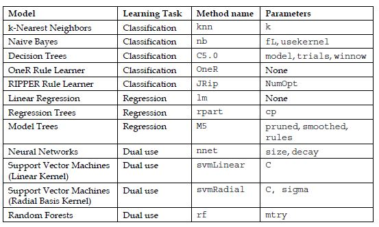
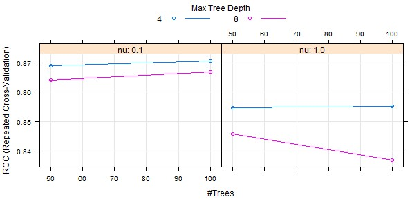
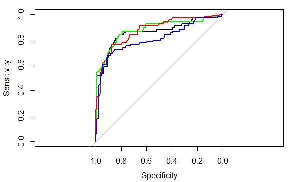
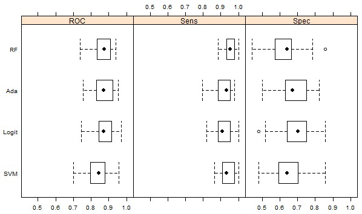

## 11 장 타이닉 데이터를 사용한 기계학습 실습 


  * 이런 유형의 문제를 .. 분류와 계층 확률 추정이라고 함 
    * 각 개인이 어느 계층에 속할지를 예측하는 것
    * 일반적으로 계측은 상호 배타적임
    * ex) "메가텔 고객 중 마케팅 제안을 받아들일 가능성이 잇는 고객은? " 과 같은 질문에 대해 수용하는 계층과 거부하는 계층으로 나누는 경우

###  11.1 타이타닉 데이터 형식 


###  11.2 데이터 불러오기

```{r}
options(width=150)

# Titanic.path <- "/home/machi/r-test/11장_타이타닉예제/"
Titanic.path <- "C:\\test\\r_test\\11장_타이타닉예제\\"
train.data.file <- "train.csv"
test.data.file <- "test.csv"  ## Survived 칼럼 값이 없음 
missing.types <- c("NA", "")

## 타입을 지정함 
train.column.types <- c('integer',   # PassengerId
                        'factor',    # Survived 
                        'factor',    # Pclass, 1,2,3등석
                        'character', # Name
                        'factor',    # Sex
                        'numeric',   # Age
                        'integer',   # SibSp, 함께 탑승한 형제 또는 배우자 
                        'integer',   # Parch, 함께 탑승한 부모 또는 자녀의 수 
                        'character', # Ticket, 티켓 번호
                        'numeric',   # Fare, 티켓 요금 
                        'character', # Cabin, 선실번호 
                        'factor'     # Embarked , 탑승한 곳 
)

##  # no Survived column in test.csv
test.column.types <- train.column.types[-2] 

readData <- function(path.name, file.name, column.types, missing.types) {
#   read.csv( url( paste(path.name, file.name, sep="") ), 
  read.csv( paste(path.name, file.name, sep=""), 
            colClasses=column.types,
            na.strings=missing.types , stringsAsFactors = F)
}

```


### 테스트 데이터 분리 

```{r}

train.raw <- readData(Titanic.path, train.data.file, 
                      train.column.types, missing.types)
df.train <- train.raw
str(df.train)


df.train$Survived <- factor(df.train$Survived, levels=c(0,1),labels=c("dead","Survived"))
# names(df.train)
levels(df.train$Embarked)
table(df.train$Embarked)

# table(df.train.train$Cabin)

test.raw <- readData(Titanic.path, test.data.file, test.column.types, missing.types)
df.infer <- test.raw 

```

### Data Munging

```{r}


# install.packages("Hmisc")
suppressPackageStartupMessages({
  library(Hmisc)
})


## method="reverse" 는 종속변수 survived 에 따라 독립 변수들을 분할하여 보여줌 

names(df.train)
summary(Survived ~ Pclass + Sex + Age + SibSp + Parch + Fare + Embarked, data = df.train, 
        method="reverse")


## 이를 그래프로 확인을
# install.packages("Amelia")
require(Amelia)
missmap(df.train, main="Titanic Training Data - Missings Map", 
        col=c("yellow", "black"), legend=FALSE)


## 실제 Embarked 필드에서 null 값이 있는 행에 대해서 확인을  
knitr::kable(df.train[!complete.cases(df.train$Embarked),])


barplot(table(df.train$Survived),
        names.arg = c("Perished", "Survived"),
        main="Survived (passenger fate)", col="black")
barplot(table(df.train$Pclass), 
        names.arg = c("first", "second", "third"),
        main="Pclass (passenger traveling class)", col="firebrick")
barplot(table(df.train$Sex), main="Sex (gender)", col="darkviolet")
hist(df.train$Age, main="Age", xlab = NULL, col="brown")
barplot(table(df.train$SibSp), main="SibSp (siblings + spouse aboard)", 
        col="darkblue")
barplot(table(df.train$Parch), main="Parch (parents + kids aboard)", 
        col="gray50")
hist(df.train$Fare, main="Fare (fee paid for ticket[s])", xlab = NULL, 
     col="darkgreen")
barplot(table(df.train$Embarked), 
        names.arg = c("Cherbourg", "Queenstown", "Southampton"),
        main="Embarked (port of embarkation)", col="sienna")


mosaicplot(df.train$Pclass ~ df.train$Survived, 
           main="Passenger Fate by Traveling Class", shade=FALSE, 
           color=TRUE, xlab="Pclass", ylab="Survived")


mosaicplot(df.train$Sex ~ df.train$Survived, 
             main="Passenger Fate by Gender", shade=FALSE, color=TRUE, 
             xlab="Sex", ylab="Survived")

boxplot(df.train$Age ~ df.train$Survived, 
        main="Passenger Fate by Age",
        xlab="Survived", ylab="Age")

mosaicplot(df.train$Embarked ~ df.train$Survived, 
           main="Passenger Fate by Port of Embarkation",
           shade=FALSE, color=TRUE, xlab="Embarked", ylab="Survived")

# install.packages("corrgram")
require(corrgram)
require(plyr)
corrgram.data <- df.train
## change features of factor type to numeric type for inclusion on correlogram
corrgram.data$Survived <- as.numeric(corrgram.data$Survived)
corrgram.data$Pclass <- as.numeric(corrgram.data$Pclass)
corrgram.data$Embarked <- revalue(corrgram.data$Embarked, c("C" = 1, "Q" = 2, "S" = 3))
## generate correlogram
corrgram.vars <- c("Survived", "Pclass", "Sex", "Age", "SibSp", "Parch", "Fare", "Embarked")
corrgram(corrgram.data[,corrgram.vars], order=FALSE, 
         lower.panel=panel.ellipse, upper.panel=panel.pie, 
         text.panel=panel.txt, main="Titanic Training Data")

# summary(df.train$Age)
# names(df.train)

```

### 간단한 모델 적용 

이 절에서는 기계학습 모델을 적용해 보고자 함 
여기서는 의사결정 나무 모델(rpart) 와 조건부 추론 나무(ctree) 를 사용함 

이유는 .. 쉽고 .. 다양한 변수의 상호 작용을 잘 표현해 주며,   
NA 값에 대한 대리 변수 처리가 잘 되기 때문임 

####  평가 메트릭 

탑승객 생존 여부 예측 모델의 성능은 정확도(accuracy) 로 하기로 함   
예측값과 실제값의 정확도는 아래와 같이 계산 (예시)

```{r}
predicted <- c(1,0,0,1,1)
actual <- c(1,0,0,0,0)
sum(predicted == actual) / NROW(predicted)
```


#### 홀드아웃 기법 

  * 일반적으로 훈련, 테스트, 검증은 50:25:25 로 나눔
  * 여기서는 데이터가 많지 않기 때문에 훈련:테스트, 80:20 으로 나눔 
  * caret::createDataPartition() 함수를 사용함 

```{r}
# install.packages("caret")
suppressPackageStartupMessages({
  library(caret)
})
set.seed(23)
training.rows <- createDataPartition(df.train$Survived,  p = 0.8, list = FALSE)
train.batch <- df.train[training.rows, ]
test.batch <- df.train[-training.rows, ]
```


#### 의사결정나무 

```{r}
suppressPackageStartupMessages({
  library(rpart)
})


m <- rpart(
  Survived ~ Pclass + Sex + Age + SibSp + Parch + Fare + Embarked, 
  data = train.batch
  )

## 훈련 데이터 기반 
p_rtree <- predict(m, newdata=test.batch, type="class")
rpart_result <- list(actual=test.batch$Survived, predicted=p_rtree)
head(rpart_result)


## 정확도 평가 
sum(rpart_result$predicted == rpart_result$actual) / NROW(rpart_result$actual)  # 10겹 교차는 뒤쪽에서 진행, 그때 정확도도 평균, 표준편차를 표시, 밀도그림도 .. 뒤쪽에서 보여줘야 겠고

```


#### 조건부의사결정나무 

```{r}

suppressPackageStartupMessages({
  library(party)
})


model_ctree <- ctree(
  Survived ~ Pclass + Sex + Age + SibSp + Parch + Fare + Embarked, 
  data = train.batch
)
  
# predicted2  <- predict(model_rpart, newdata=df.train, type="class")
# cpart_result <- list(actual=df.train$Survived, predicted=predicted2)

## 훈련 데이터 기반 
p_ctree <- predict(model_ctree, newdata=test.batch, type="response")
ctree_result <- list(actual=test.batch$Survived, predicted=p_ctree)
head(ctree_result)

## 정확도 평가 
sum(ctree_result$predicted == ctree_result$actual) / NROW(ctree_result$actual)  # 10겹 교차는 뒤쪽에서 진행, 그때 정확도도 평균, 표준편차를 표시


```

> rpart 대비 성능이 향상되었음    

### 새로운 feature 추출

  * 계속적으로 모델을 향상시키는 것으로, 
    * 다른 모델링 기법을 적용하는 방안과
    * 데이터 내 숨겨진 쓸 만한 다른 특징 값을 찾는 방법이 있음 

여기서는 후자 쪽 접근을 .. 시도함 
구체적으로 하고자 하는 것은 
  * ticket 을 사용한 가족 식별 
    * 한 가족이 표를 샀다면 티켓 번호가 같을 것이다. 
    * 티켓 가격정보도 가족수만큼 1/n 해서 정상화함 
  * null 값을 적절히 채워 준다. 
    * 많이 비어 있는 Age 필드를 유추해서 채워본다 
      * 앞에서 부모 자녀 여부를 판단하고 나면 부모의 평균 생존 확률(avg_parent_prob)과 자녀의 평균 생존 확률을 다음과 같이 구함
    * Embarked 필드는 제일 많은 S 값으로 채워줌 
  * "15세 이하 여자를 우선 구명보트에 태워야 한다"는 규정을 고려해서 해당 조건여부 feature를 추가하고 
  * "구명보트에 가까운 선실에 있는 사람은 생존 가능성이 크다" 는 가설을 검증 
  

주의할 점은 앞서 훈련, 테스트를 분리한 것을 합쳐서 사용함, 
전체 데이터를 가지고 처리 및 feature 분리를 할 것임 

```{r}

suppressPackageStartupMessages({
  library(plyr)
})


  train.batch$type <- "T"
  test.batch$type <- "V"
  all <- rbind(train.batch, test.batch)  ## ticket 을 통해 가족ID를 부여하기 위해 훈련데이터와 테스트 데이터를 합침 
  
  ## mbarked 필드는 제일 많은 S 값으로 채워줌 
  summary(all$Embarked)
  all$Embarked[which(is.na(all$Embarked))] <- 'S'


### 당초 타이틀을 통해 나이 등을 유추하는 것 추가
### 기존 대비 차이점은 all  상태에서 처리를 

head(df.train$Name, n=10L)
getTitle <- function(data) {
  title.dot.start <- regexpr("\\,[A-Z ]{1,20}\\.", data$Name, TRUE)
  title.comma.end <- title.dot.start + attr(title.dot.start, "match.length")-1  ## copy&paste 시 중간 공백주의 필요 
  data$Title <- substr(data$Name, title.dot.start+2, title.comma.end-1)
  return(data$Title)
} 


 all$Title <- getTitle(all)
 unique(all$Title)

options(digits=2)
require(Hmisc)
bystats(all$Age, all$Title, 
        fun=function(x)c(Mean=mean(x),Median=median(x)))


titles.na.train <- c("Dr", "Master", "Mrs", "Miss", "Mr")


imputeMedian <- function(impute.var, filter.var, var.levels) {
  for(v in var.levels) {
    impute.var[which(filter.var == v)] <- impute(impute.var[which(filter.var == v)])
  }
  return(impute.var)
}

all$Age[which(all$Title=="Dr")]

all$Age <- imputeMedian(all$Age, all$Title, titles.na.train)
all$Age[which(all$Title=="Dr")]


subset(all, Fare < 7)[order(subset(all, Fare < 7)$Fare, 
                          subset(all, Fare < 7)$Pclass), c("Age", "Title", "Pclass", "Fare")]


## impute missings on Fare feature with median fare by Pclass
all$Fare[ which(all$Fare == 0)] <- NA
all$Fare <- imputeMedian(all$Fare, all$Pclass, as.numeric(levels(all$Pclass)))

all$Title <- factor(all$Title,c("Capt","Col","Major","Sir","Lady","Rev","Dr","Don","Jonkheer","the Countess","Mrs","Ms","Mr","Mme","Mlle","Miss","Master","Noble"))   ##Noble 를 추가해줌 
# head(all[,c("Age", "Title")], n=100)
boxplot(all$Age ~ all$Title, 
        main="Passenger Age by Title", xlab="Title", ylab="Age")

## function for assigning a new title value to old title(s) 
changeTitles <- function(data, old.titles, new.title) {
  for(honorific in old.titles) {
    data$Title[which(data$Title == honorific)] <- new.title
  }
  return(data$Title)
}

str(all)
levels(all$Title)

## Title consolidation
all$Title <- changeTitles(all, c("Capt", "Col", "Don", "Dr", "Jonkheer", "Lady", "Major", "Rev", "Sir"),"Noble")
all$Title <- changeTitles(all, c("the Countess", "Ms"), "Mrs")
all$Title <- changeTitles(all, c("Mlle", "Mme"), "Miss")
all$Title <- as.factor(all$Title)

require(plyr)     # for the revalue function 
require(stringr)  # for the str_sub function

## test a character as an EVEN single digit
isEven <- function(x) x %in% c("0","2","4","6","8") 
## test a character as an ODD single digit
isOdd <- function(x) x %in% c("1","3","5","7","9") 

## function to add features to training or test data frames
featureEngrg <- function(data) {
  ## Using Fate ILO Survived because term is shorter and just sounds good
  data$Fate <- data$Survived
  ## Revaluing Fate factor to ease assessment of confusion matrices later
  data$Fate <- revalue(data$Fate, c("1" = "Survived", "0" = "Perished"))
  ## Boat.dibs attempts to capture the "women and children first"
  ## policy in one feature.  Assuming all females plus males under 15
  ## got "dibs' on access to a lifeboat
  data$Boat.dibs <- "No"
  data$Boat.dibs[which(data$Sex == "female" | data$Age < 15)] <- "Yes"
  data$Boat.dibs <- as.factor(data$Boat.dibs)
  ## Family consolidates siblings and spouses (SibSp) plus
  ## parents and children (Parch) into one feature
  data$Family <- data$SibSp + data$Parch
  ## Fare.pp attempts to adjust group purchases by size of family
  data$Fare.pp <- data$Fare/(data$Family + 1)
  ## Giving the traveling class feature a new look
  data$Class <- data$Pclass
  data$Class <- revalue(data$Class, 
                        c("1"="First", "2"="Second", "3"="Third"))
  ## First character in Cabin number represents the Deck 
  data$Deck <- substring(data$Cabin, 1, 1)
  data$Deck[ which( is.na(data$Deck ))] <- "UNK"
  data$Deck <- as.factor(data$Deck)
  ## Odd-numbered cabins were reportedly on the port side of the ship
  ## Even-numbered cabins assigned Side="starboard"
  data$cabin.last.digit <- str_sub(data$Cabin, -1)
  data$Side <- "UNK"
  data$Side[which(isEven(data$cabin.last.digit))] <- "port"
  data$Side[which(isOdd(data$cabin.last.digit))] <- "starboard"
  data$Side <- as.factor(data$Side)
  data$cabin.last.digit <- NULL
  return(data)
}

## add remaining features to training data frame
all <- featureEngrg(all)


  summary(all$Fare)  ## 이 정보와 앞서 EDA쪽을 연결시킴 

  ctree_model <- ctree(Survived ~ Pclass + Sex + Age + SibSp + Parch + Fare + Embarked,data = all)

#   all <- df.train
  
  all$prob <- sapply(predict(ctree_model,type="prob", newdata=all), function(result){ result[1]})
  head(all)
  
  ## 티켓 번호를 사용한 family_id
  family_idx <- 0
  ## 같은Ticket 값을 갖는 행끼리 그룹핑 , 번호를 부여해줌 
  ticket_based_family_id <- ddply(all, .(Ticket), function(rows) {    
    family_idx <<- family_idx +1
    return(data.frame(family_id=paste0("TICKET_", family_idx)))
  })
  

  all <- adply(all
    , 1
    , function(row) {
        family_id <- NA
        if(!is.na(row$Ticket)) {
          family_id <- subset(ticket_based_family_id, Ticket == row$Ticket)$family_id
        }
        return(data.frame(family_id=family_id))
      })

  ### avg_prob 를 구함
  all <- ddply(all,
      .(family_id)
      , function(rows){
          rows$avg_prob <- mean(rows$prob)
          return(rows)
      })


  ### 탑승객이 부모 또는 자녀 중 어느 쪽에 속하는지를 알아봄
  ### 판단 기준은 나이를 사용

  all <- ddply(all, .(family_id), function(rows){
            rows$maybe_parent <- FALSE
            rows$maybe_child <- FALSE
            if(NROW(rows) == 1 || ## 1명이면 부모도 자녀도 아님
              sum(rows$Parch) == 0 || ## 역시 부모도 자녀도 아님
              NROW(rows) == sum(is.na(rows$Age))){ ## 행에 나이가 저장되어 있지 않으면 알 수 없음
              return (rows)
            }

            max_age <- max(rows$Age, na.rm=TRUE)
            min_age <- min(rows$Age, na.rm=TRUE)

            ## 부모인지 , 자녀인지 
            return(adply(rows, 1, function(row){
              if(!is.na(row$Age) && !is.na(row$Sex)) {
                row$maybe_parent <- (max_age - row$Age) < 10 ## > 로 되어야 하는 것 아닌가?
                row$maybe_child <- (row$Age - min_age) < 10
              }
              return(row)
          }))

        })

  ## avg_parent_prob , avg_child_prob
  all <- ddply(all, .(family_id), function(rows) {
              rows$avg_parent_prob <- rows$avg_prob ## 기본값은 가족의 평균 생존 확률
              rows$avg_child_prob <- rows$avg_prob ## 기본값은 가족의 평균 생존 확률
              if(NROW(rows) == 1 || sum(rows$Parch) == 0 ) {
                return(rows)
               }
              parent_prob <- subset(rows, maybe_parent == TRUE)[,"prob"]
              if(NROW(parent_prob) > 0 ) {
                  rows$avg_parent_prob <- mean(parent_prob)
              }
              child_prob <- subset(rows, maybe_child == TRUE)[,"prob"]
              if(NROW(child_prob) > 0 ) {
                rows$avg_child_prob <- mean(child_prob)
              }

              return(rows)
          })


  ## ctree 모델
  train.batch <- subset(all, type == "T")
  # str(f$train)
  test.batch <- subset(all, type == "V")
  # 새로 구성한 변수들을 독립 변수로 추가하여 ctree() 모델 생성
  ## 당연히 모델은 훈련데이터로 만들고 
  m <- ctree(Survived ~ Pclass + Sex + Age + SibSp + Parch + Fare + Embarked
        + maybe_parent + maybe_child + avg_prob + avg_parent_prob + avg_child_prob,data=train.batch)
  print(">>>> 새로운 특징을 적용한 ctree 모델 생성 결과")
  print(m)
  print(">>>> 새로 추가된 특징(maybe_parent + maybe_child + avg_prob + avg_parent_prob + avg_child_prob)들이 ctree의 상위 노드에 사용되는지 확인해보자)")
  # 생성된 ctree 모델에 검증 데이터 적용
  test.batch$familyid_predicted <- predict(m, newdata=test.batch)
  head(test.batch)
  # 검증 데이터에 대해 생존 여부 예측 결과(predicted) 및 실제 결과(actual)를 합쳐 list로 반환


##성능평가 결과는 다음과 같음
(family_accuracy <- sum(test.batch$familyid_predicted == test.batch$Survived) / NROW(test.batch$Survived) )

```

추가 feature 로 정확도가 상승했는지 확인을 하고,,, (ctree 모델을 통해)


Some color on the features I've added:

아래 내용을 그다지 효과가 없었으니 생략. 너무 복잡해 지기만 함   

>  * Boat.dibs - assumes all females plus males under 15 get "dibs' on access to a lifeboat. >Filtering by Title="Master" was considered, but the highest age in the training data for males >addressed as "Master" was just 12, and I wanted to account for male teens with Title="Mr" who >could pass for a child.
>  * Deck - levels are as shown in the Titanic cross-section displayed previously. Cabin data >provided for just 23 percent of training data records, so it's tough to give this one much >emphasis.
>  * Side - subject to the same concern (dearth of data) expressed for Deck

```{r}
# train.keeps <- c("Fate", "Sex", "Boat.dibs", "Age", "Title", 
#                 "Class", "Deck", "Side", "Fare", "Fare.pp", 
#                   "Embarked", "Family","Survived")  ## Survived 을 추가함 
# df.train.munged <- df.train[train.keeps]
```

### Fitting a Model

#### 로지스틱 회귀분석을 통한 변수 최적화

```{r}

(Titanic.logit.1 <- glm(Survived ~ Pclass + Sex + Age + SibSp + Parch + Fare + Embarked
        + maybe_parent + maybe_child + avg_prob + avg_parent_prob + avg_child_prob,data=train.batch, family=binomial("logit")))

# 이에 대한 p-value 는 아래와 같이 구함 
### The deviance was reduced by 332.2(950.9-618.7) points on 713-705=8 degrees of freedom (DF), a significant reduction..
1 - pchisq((765.4-464.5), df=(568-554))  ## 0 유의미한 차이가 있고, 모델이 잘 수행한다고 봐야 ??  
                       
```

추가로 다른 feature 조합 들간의 비교를 위해 `anova()`를 사용 

```{r}
# anova(Titanic.logit.1)
anova(Titanic.logit.1, test="Chisq")
```

Deviance (편차), Resid. Df (Residual degrees of freedom, 잔차 자유도), Resid. Dev(Residual Deviance, 잔차 편차)
  
여기서 Sex, Pclass, Age, avg_prob 변수의 중요도를 확인하였음.

```{r}
Titanic.logit.2 <- glm(Survived ~ Sex + Pclass + Age + avg_prob, data = train.batch, family=binomial("logit"))
anova(Titanic.logit.2, test="Chisq")

```
  
  
  Time to shift the model fitting to a higher gear. Henceforth, I'm going to use the train function in Kuhn's caret package to fit binary logistic regression models, as well as models built using other methods.

Modeling taken to an extreme on a training data set can leave you with a model which very accurately maps the training data, but does not generalize well to new samples. This phenomenon, commonly referred to as overfitting, can be addressed by resampling the training samples in a way which approximates the fitted model's performance on future data. I'm going to use a form of resampling known as 10-fold cross-validation (CV), repeated 3 times.

Later, I plan to compare the fitted logit model to other model types using the receiver operating characteristic (ROC) curve. The twoClassSummary function in caret can calculate the figures I'll need for that if I give it class probabilities predicted by the logistic regression model.

All of these things I want -- 3x 10-fold CV, estimation of class probabilities, metrics from twoClassSummary -- can be passed through the trainControl function

   * 교차 검증 후 테스트 
    * 데이터를 훈련 데이터와 테스트 데이터로 분리함 
    * 훈련 데이터에 대해 K겹 교차 검증(보통 10겹) 을 수행하여 어떤 모델링 기법이 가장 우수한지를 결정함 
        1. 데이터를 10 등분하여 $D_{1}$, $D_{2}$,,,,, $D_{10}$으로 분할함 
        2. K 값을 1로 초기화 함
        3. $D_{K}$ 를 검증 데이터, 그 외의 데이터를 훈련 데이터로 하여 모델을 생성함 
        4. 검증 데이터 $D_{K}$ 를 사용해 모델의 성능을 평가함, 평가된 모델의 성능을 $P_{K}$ 라 함 
        5.  K 가 9이하인 값이면 K = K + 1 을 하고 다시 3단계로 감, 만약 K=10 이면 종료함 
          * 모델의 성능이 $P_{1}$,$P_{2}$,,,, $P_{10}$ 으로 구해지며, 최종 성능은 이들의 산술 평균으로 정함 
    * 해당 모델링 기법으로 훈련 데이터 전체를 사용해 최종 모델을 만듬
    * 테스트 데이터에 최종 모델을 적용해 성능을 평가하고, 그 결과를 최종 모델과 함께 제출함


```{r}
cv.ctrl <- trainControl(method = "repeatedcv", repeats = 3,
                        summaryFunction = twoClassSummary,
                        classProbs = TRUE)
```

Below is the train function call using the same formula (sans Fare) that we recently passed through glm function. I use the metric argument to tell train to optimize the model by maximizing the area under the ROC curve (AUC). summary(), another extractor function, is called to generate regression coefficients with standard errors and a z-test, plus the residual deviance metric we were watching earlier.

```{r}
# install.packages("pROC")

suppressPackageStartupMessages({
  library(pROC)
})
set.seed(35)
glm.tune.1 <- train(Survived ~ Sex + Pclass + Age + avg_prob
                    ,data = train.batch
                    ,method = "glm"
                    ,metric = "ROC"  ## ROC 구체적으로는 AUC 가 최대가 되도록 최적화 하겠다는 의미임 
                    ,trControl = cv.ctrl)
glm.tune.1
summary(glm.tune.1)
```

> 기존 코드보다는 결과가 좋아짐 

This is as good a time as any to introduce the concept of class compression. Think of it as collapsing particular levels on a categorical variable. One of the earlier bar graphs showed about 70 percent of the Titanic's passengers boarded the ship at Southampton. I'm going to use Embarked and the I() function, which inhibits interpretation & conversion of R objects, to create a new 2-level factor within the model formula. This factor is valued TRUE if a passenger's port of origin was Southampton ("S"), or FALSE otherwise.

Embarked의 기존 3레벨을 2레벨로 .. (차원축소??)


```{r}
set.seed(35)
glm.tune.2 <- train(Survived ~ Sex + Pclass + Age + avg_prob + I(Embarked=="S")
                      ,data = train.batch
                      , method = "glm"
                      ,metric = "ROC"
                      , trControl = cv.ctrl)
summary(glm.tune.2)
```

As I discussed earlier, the 'Title' feature addresses more than one theme. For that reason, I believe it has real potential to improve this model. Besides, I put a good chunk of effort into it, so why not give it a go?

```{r}
set.seed(35)
glm.tune.3 <- train(Survived ~ Sex + Pclass + Age + avg_prob + I(Embarked=="S")
                    , data = train.batch
                    , method = "glm"
                    ,metric = "ROC"
                    , trControl = cv.ctrl)
summary(glm.tune.3)
```

Nice! That gave us our first material decline in the residual deviance. Since the Title feature seems to give us everything that Age did (and more), I'm going to drop Age from the formula. I will also collapse the titles “Miss” and “Mrs” and leave a duo of Title-related factors which should represent the “women and children first” theme well.


```{r}
# set.seed(35)
# glm.tune.4 <- train(Fate ~ Class + I(Title=="Mr") + I(Title=="Noble") + Age + Family + I(Embarked=="S")
#                     ,data = train.batch
#                     ,method = "glm"
#                     ,metric = "ROC"
#                     , trControl = cv.ctrl)
# summary(glm.tune.4)
```


Remember that there were a lot of male passengers in third class. Given the “women and children first” policy already mentioned plus reports that the Titanic's internal layout was confusing (I recall reading that one crew member claimed it took him two weeks to become comfortable with finding his way around the ship), to say that “grown men in the lower decks had it tough” is such a gross understatement that I hesitated to put it in type. A feature reflecting those third-class men might make a further dent in that residual deviance. Indeed, it does...

변수의 특정 조건 연산을 통해 feature를 추가 ..   

```{r}
# set.seed(35)
# glm.tune.5 <- train(Fate ~ Class + I(Title=="Mr") + I(Title=="Noble") + Age + Family + I(Embarked=="S") + I(Title=="Mr"&Class=="Third")
#                     , data = train.batch
#                     , method = "glm"
#                     , metric = "ROC"
#                     , trControl = cv.ctrl)
# summary(glm.tune.5)
```

가장 낮은 AIC 도출 .. 

#### Other Models 

지금까지 새로운 feature 를 생성해 보고, 변수의 특정 조건 연산을 통해 feature를 추가해 보기도 하였음 ( `I(Title=="Mr"&Class=="Third")`)

이번에는 알고리즘 변경 및 최적화를 통해 예측 성능을 개선하는 접근을 시도함 
이또한 다음과 같은 접근을 필요로 함 


  * 데이터에 대해 훈련해야 할 기계 학습 모델이 무엇인가? 
  * 어떤 모델 매개변수를 조절하고 최적의 설정을 찾기 이해 어떻게 조절할 것인가?  
    * 
  * 최적의 후보자를 구별하기 위해 모델을 평가하는 기준은 무엇인가? 
  * 최신 기법, 패키지를 사용해 볼 것인가? 


여기서는 boosting -> 앙상블 -> 보다 발전적인 Random Forest 순으로 살펴봄   

Logistic regression is certainly not the only binary classification model available. There are plenty more ???- perhaps too many for some data scientists to digest. For purpose of illustration, I'll simply take the logistic regression model formula from glm.tune.1 and pass it through train() for each of three other model types, with one new twist: tuning variables specific to each model.

First up is `boosting`. I can instruct train to fit a stochastic boosting model for the binary response Fate using the adapackage and a range of values for each of three tuning parameters. Concretely, when fitting a model using train with method=”ada”, one has three levers to tweak: `iter` (number of boosting iterations, default=50), `maxdepth` (depth of trees), and `nu` (shrinkage parameter, default=1). Create a data frame with these three variables as column names and one row per tuning variable combination, and you're good to go. Here is just one example of a tuning grid for ada:

```{r}
## note the dot preceding each variable
# install.packages("ada")
suppressPackageStartupMessages({
  library(ada)
})

ada.grid <- expand.grid(.iter = c(50, 100),
                        .maxdepth = c(4, 8),
                        .nu = c(0.1, 1))
```

Specify method=”ada” and tuneGrid=ada.grid in train

  
```{r}

### 여기서 많은 연산 시간을 필요로 함 , 잠시 닫아 둠 
# install.packages("doMC")
# library(doMC)    ## 리눅스머신에서 진행 시, doMC 가 사용하는 multicore 는 내부적으로 fork를 사용해 프로세스를 실행시키므로 fork를 지원하지 않는 윈도우에서는 동작하지 않는다. 
# registerDoMC(cores = 6)

## 윈도우에서는 
# install.packages("doParallel")
suppressPackageStartupMessages({
  library(doParallel)
})

registerDoParallel(cores=2)

set.seed(35)
system.time(ada.tune <- train(Survived ~ Sex + Pclass + Age + avg_prob, data = train.batch,
                  method = "ada",
                  metric = "ROC", 
                  tuneGrid = ada.grid, 
                  trControl = cv.ctrl)
) 

# 아래는 리눅스 desktop 환경에서의 기록임
# 병렬처리를 하지 않는 경우는, 다음과 같은 시간이 걸림 
#  사용자  시스템 elapsed 
# 132.532   0.000 132.697 

# 사용시 registerDoMC(cores = 5) 의 경우 
#  사용자  시스템 elapsed 
# 136.503   0.782  42.941 

# registerDoMC(cores = 8) 의 경우
#  사용자  시스템 elapsed 
# 262.851   1.867  35.355 


```

The model output shows that, given the train.batch data and 8 combinations of tuning variables tested, the optimal model had an ROC of 0.871. 

  * ROC (Repeated Cross-Validation) 
    * $ROC = \frac{Sensitivity}{Specificity}$
    * $Sensitivity (민감도) = \frac{TP}{TP + TN}$ : 정확하게 분류한 긍정이 비율(참긍정)
    * $Specificity (특이도) = \frac{TN}{TP + FP} = 1 - Sensitivity$ : 정확하게 분류된 부정의 비율(참부정)
    * Sensitivity, Specificity 는 너무 긍정적으로 쏠린다든지 혹은 너무 부정적으로 나오는 것을 감지할 수 있게 됨 
        * 각각 1에 가까울 수록 바람직하게 됨
        * 테스트의 상황에 따라 다르지만 적절한 균형이 바람직함 


```{r}

ada.tune
# plot(ada.tune)  

```



iter = 100, maxdepth = 4 and nu = 0.1 조건에서 ROC 값이 가장 큼  

Time to give the popular Random Forest (RF) model a shot at the Titanic challenge. 

랜덤포레스트에서 대해서는 아래 링크를 확인   
https://ko.wikipedia.org/wiki/%EB%9E%9C%EB%8D%A4_%ED%8F%AC%EB%A0%88%EC%8A%A4%ED%8A%B8

The number of randomly pre-selected predictor variables for each node, designated mtry, is the sole parameter available for tuning an RF with train. Since the number of features is so small, there really isn't much scope for tuning mtry in this case. Nevertheless, I'll demonstrate here how it can be done. Let's have mtry=2 and mtry=3 duke it out over the Titanic data.

```{r}
rf.grid <- data.frame(.mtry = c(2, 3)) ## mtry : 노드를 나눌 기준을 정할 때 고려할 변수의 수 
set.seed(35)
rf.tune <- train(Survived ~ Sex + Pclass + Age + avg_prob, 
                 data = train.batch,
                 method = "rf",
                 metric = "ROC",
                 tuneGrid = rf.grid,
                 trControl = cv.ctrl)
```

Strobl et al suggested setting mtry at the square root of the number of variables. In this case, that would be mtry = 2, which did produce the better RF model.


train 함수에 대해서 .. 제대로 공부할 필요가 있어 보임   

```{r}
rf.tune
plot(rf.tune)

## 최적값을 찾았으니, mtry = 2
rf.grid <- data.frame(.mtry = c(2))
(rf.tune <- train(Survived ~ Sex + Pclass + Age + avg_prob, 
                 data = train.batch,
                 method = "rf",
                 metric = "ROC",
                 tuneGrid = rf.grid,
                 trControl = cv.ctrl)
 )

# ## Age 에 null 값이 있는지 확인 
# missmap(train.batch, main="Titanic Training Data - Missings Map", 
#         col=c("yellow", "black"), legend=FALSE)
# missmap(all, main="Titanic Training Data - Missings Map", 
#         col=c("yellow", "black"), legend=FALSE)


rf.tune2 <- randomForest(Survived ~ Sex + Pclass + Age + avg_prob, data = train.batch,mtry = 2)


```


`importance = TRUE` 를 통해 변수 중요도를 확인할 수 있겠음,,, 이를 varImpPlot 을 통해서 시각화 할 수도 있겠고 .. 정규화 랜덤 포레스트 를 통해 좀 더 좋은 결과가 가능한지 확인해 볼 수 있겠음 


And finally, we'll fit a support vector machine (SVM) model to the Titanic data.

서포트 벡터머신 관련해서는 아래 링크를 참고 
https://ko.wikipedia.org/wiki/%EC%84%9C%ED%8F%AC%ED%8A%B8_%EB%B2%A1%ED%84%B0_%EB%A8%B8%EC%8B%A0


There are two functions which can be tuned for SVM using train. The default value for one of them -??? sigest ???- produces good results on most occasions. The `default grid` of cost parameter C (제약을 위반하는 비용을 명시하는 수임 ) is 0.25, 0.5, and 1. If we set train argument tuneLength = 9, the grid expands to c(0.25, 0.5, 1, 2, 4, 8, 16, 32, 64). As SVM is considered sensitive to the scale and magnitude of the presented features, I'll use the preProcess argument to instruct train to make arrangements for normalizing the data within resampling loops.

```{r}
# install.packages("kernlab")
suppressPackageStartupMessages({
  library(kernlab)
})

set.seed(35)
svm.tune <- train(Survived ~ Sex + Pclass + Age + avg_prob, 
                  data = train.batch,
                  method = "svmRadial",
                  tuneLength = 9,
                  preProcess = c("center", "scale"),
                  metric = "ROC",
                  trControl = cv.ctrl)
```

You may have noticed that the same random number seed was set prior to fitting each model. This ensures that the same resampling sets are used for each model, enabling an "apple-to-apples" comparison of the resampling profiles between models during model evaluation.

```{r}
svm.tune
plot(svm.tune)
```

Although the model output above does display ROC by cost parameter value, the following graph makes it abundantly clear that the ROC starts dropping at C=4. 


### Model Evaluation

With all four models in hand, I can begin to evaluate their performance by whipping together some cross-tabulations of the observed and predicted Fate for the passengers in the test.batch data. caret makes this easy with the confusionMatrix function.

  *  $Accuracy = \frac{TP+TN}{TP+TN+FP+FN}$ : 전체 예측에서 (예측이 Y 이든 N 이든 무관하게) 옳은 예측의 비율 
  * $Kappa = \frac{accuracy-P(e)}{1-P(e)}$ : 두 평가자가 얼마나 일치하는가 .. 다시 말해 두 평가자가 우연히 일치할 확률 
    * 0.6 ~ 0.8 : 괜찮은 일치도
    * 0.8 ~ 1   : 훌륭한 일치도 
  *  $Precision = \frac{TP}{TP+FP}$ : Y로 예측된 것 중 실제로도 Y인 경우의 비율


```{r}
# install.packages("e1071")
suppressPackageStartupMessages({
  library(e1071)
})

## Logistic regression model
glm.pred <- predict(glm.tune.1, test.batch)
confusionMatrix(glm.pred, test.batch$Survived)   ### all arguments must have the same length 에러가 나고 있음 

## Boosted model
ada.pred <- predict(ada.tune, test.batch)  ## iter, maxdept, nu 최적화값을 활용하면 어떤가?  
confusionMatrix(ada.pred, test.batch$Survived)

## Random Forest model
rf.pred <- predict(rf.tune, test.batch)   ## mtry=2 같은 것을 사용하지 않을까? 
confusionMatrix(rf.pred, test.batch$Survived)

## SVM model 
svm.pred <- predict(svm.tune, test.batch)
confusionMatrix(svm.pred, test.batch$Survived)

```

(Perhaps now you've come to appreciate why I revalued the Fate feature earlier!) While there are no convincing conclusions to be drawn from the confusion matrices embedded within the outputs above, the logistic regression model we put together earlier appears to do the best job of selecting the survivors among the passengers in the test.batch. The Random Forest model, on the other hand, seems to have a slight edge on predicting those who perished.

We can also calculate, using each of the four fitted models, the predicted probabilities for the test.batch, and use those probabilities to plot the ROC curves.

```{r}

# install.packages("ROCR")
suppressPackageStartupMessages({
  library(ROCR)
})

# Logistic regression model (BLACK curve)
glm.probs <- predict(glm.tune.1, test.batch, type = "prob")  ## 5 -> 1 로 변경함 
glm.ROC <- roc(response = test.batch$Survived,
                predictor = glm.probs$Survived,
                levels = levels(test.batch$Survived))
plot(glm.ROC, type="S")     ## 에러 발생 
# Area under the curve: 0.8609 


## Boosted model (GREEN curve)
ada.probs <- predict(ada.tune, test.batch, type = "prob")
ada.ROC <- roc(response = test.batch$Survived,
            predictor = ada.probs$Survived,
            levels = levels(test.batch$Survived))
# plot(ada.ROC, add=TRUE, col="green")
plot(ada.ROC, add=TRUE, col="green")  
## Area under the curve: 0.8759


## Random Forest model (RED curve)
rf.probs <- predict(rf.tune, test.batch, type = "prob")
rf.ROC <- roc(response = test.batch$Survived,
           predictor = rf.probs$Survived,
           levels = levels(test.batch$Survived))
plot(rf.ROC, add=TRUE, col="red") 
## Area under the curve: 0.8713


## SVM model (BLUE curve)
svm.probs <- predict(svm.tune, test.batch, type = "prob")
svm.ROC <- roc(response = test.batch$Survived,
            predictor = svm.probs$Survived,
            levels = levels(test.batch$Survived))
plot(svm.ROC, add=TRUE, col="blue")
# Area under the curve: 0.8077

```


실제 문서상에 있던 plot  


  * ROC 커브 
    * 거짓긍정(긍정으로 잘못 예측한) 값에 따른 참긍정 비율 
    * 2차 세계대전 중 진짜신호와 거짓 알림을 구별하기 위해 개발했다고 함 


AUC 값은 아래와 같은 방법으로 구할 수 있음 
`unlist(rf.ROC@y.values)`

The following R script uses caret function resamples to collect the resampling results, then calls the dotplot function to create a visualization of the resampling distributions. I'm typically not one for leaning on a single metric for important decisions, but if you have been looking for that one graph which sums up the performance of the four models, this is it.

```{r}
cv.values <- resamples(list(Logit = glm.tune.1, Ada = ada.tune, 
                            RF = rf.tune, SVM = svm.tune))
cv.values
dotplot(cv.values, metric = "ROC")
```

The next graph (my last, scout's honor) compares the four models on the basis of ROC, sensitivity, and specificity. Here, sensitivity (“Sens” on the graph) is the probability that a model will predict a Titanic passenger's death, given that the passenger actually did perish. Think of sensitivity in this case as the true perished rate. Specificity (“Spec”), on the other hand, is the probability that a model will predict survival, given that the passenger actually did survive. Simply put, all four models were better at predicting passenger fatalities than survivals, and none of them are significantly better or worse than the other three. Of the four, if I had to pick one, I'd probably put my money on the logistic regression model. alt text





Let me reiterate the point I made in the disclaimer, way up at the top of this tl;dr page: This journey, paved with text and graphs, was never intended to reveal a path to discovery of the best model for predicting the fate of the passengers referenced in the Titanic data set. I sought only to demonstrate use of a subset of the tools ??? methods and software (R in this case) ??? a data scientist can employ in pursuit of a binary classification model.

### Cast Your Votes

Given everything we've been through here, it would be a shame if we didn't submit at least one of the four models to the Titanic competition at Kaggle. Here is a script which munges the data Kaggle provided in their test.csv file, uses that data and the logistic regression model glm.tune.5 to predict the survival (or not) of passengers listed in the test file, links the predictions to the PassengerId in a data frame, and writes those results to a submission-ready csv file.

```{r}
# # get titles
# df.infer$Title <- getTitle(df.infer)
# 
# # impute missing Age values
# df.infer$Title <- changeTitles(df.infer, c("Dona", "Ms"), "Mrs")
# titles.na.test <- c("Master", "Mrs", "Miss", "Mr")
# df.infer$Age <- imputeMedian(df.infer$Age, df.infer$Title, titles.na.test)
# 
# # consolidate titles
# df.infer$Title <- changeTitles(df.infer, c("Col", "Dr", "Rev"), "Noble")
# df.infer$Title <- changeTitles(df.infer, c("Mlle", "Mme"), "Miss")
# df.infer$Title <- as.factor(df.infer$Title)
# 
# # impute missing fares
# df.infer$Fare[ which( df.infer$Fare == 0)] <- NA
# df.infer$Fare <- imputeMedian(df.infer$Fare, df.infer$Pclass, 
#                                 as.numeric(levels(df.infer$Pclass)))
# # add the other features
# df.infer <- featureEngrg(df.infer)
# 
# # data prepped for casting predictions
# test.keeps <- train.keeps[-1]
# pred.these <- df.infer[test.keeps]
# 
# # use the logistic regression model to generate predictions
# Survived <- predict(glm.tune.5, newdata = pred.these)
# 
# # reformat predictions to 0 or 1 and link to PassengerId in a data frame
# Survived <- revalue(Survived, c("Survived" = 1, "Perished" = 0))
# predictions <- as.data.frame(Survived)
# predictions$PassengerId <- df.infer$PassengerId
# 
# # write predictions to csv file for submission to Kaggle
# setwd("C:\\test\\r_test\\11장_타이타닉예제\\")
# write.csv(predictions[,c("PassengerId", "Survived")], 
#           file="Titanic_predictions.csv", row.names=FALSE, quote=FALSE)

```

